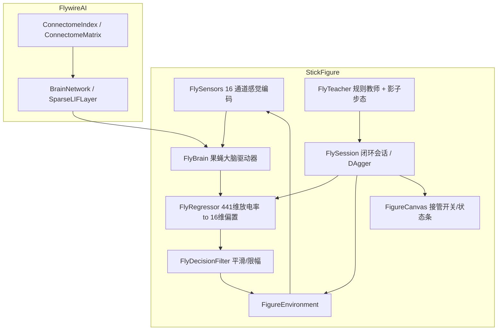

## 产品概述
将已有的果蝇全脑 SNN 脉冲神经网络仿真模型（FlywireAI.vbproj，FAFBv783 连接组，13.9 万神经元）与已建成的 3D 火柴人物理仿真（StickFigure.vbproj）串联：果蝇大脑作为火柴人的"上位控制器"，通过感觉编码 → 全脑脉冲传播 → 运动神经元放电率 → 连续关节偏置的通路，驱动火柴人在三维场景中行走、奔跑、跳跃、跨越障碍、登上台阶。

## 核心功能
- **果蝇大脑驱动器**：把 16 维感觉通道强度注入 afferent 感觉神经元，每 tick 用 `SparseLIFLayer.ForwardStep` 推进全脑，读出 efferent 运动神经元的滑动窗放电率。
- **连续关节偏置读出**：线性回归读出层把 441 维放电率映射为 16 维关节目标角度偏置（髋/膝/踝/肩/肘/脊柱），经平滑与变化率限幅后叠加在基准步态之上。
- **规则教师 + 模仿学习**：规则教师根据世界状态（障碍距离、台阶、朝向偏差）用影子步态引擎生成期望姿态，与基准 Walk 姿态逐字段求差得到教师偏置；采集(放电率， 偏置)样本训练读出层，再做 DAgger 修正。
- **闭环会话**：绑定环境与大脑的闭环驱动，大脑按 1/4 物理步降频推进（15 Hz），两次大脑 tick 之间保持上一次偏置。
- **无头 CLI**：`--brain-train`（装配 + 训练 + 存权重 csv）、`--brain-run`（加载权重闭环跑并输出指标），可脱离 WinForms 直接跑。
- **UI 接管**：主界面增加「果蝇大脑接管」开关（惰性装配大脑）、训练按钮、大脑活跃度/当前偏置/状态条。

## 技术栈
- 语言：VB.NET（net10.0-windows WinForms 宿主 + net10.0 库）
- SNN：FlywireAI（FAFBv783 连接组 CSR + `SparseLIFLayer.ForwardStep`）
- 物理：既有 `PhysicsWorld3D`（StickFigure 内置 3D 刚体模块）
- 引用：`StickFigure.vbproj` 增加 `..\FlywireAI\FlywireAI.vbproj`（SNN/TensorFlow/ILCudaTensor 经传递引用带入）

## 架构

## 关键实现要点
- **感觉通道（16 维，与贪吃蛇 demo 对称）**：0..7 任务目标方位扇区（下一目标=障碍/台阶，8 扇区 × 距离衰减）；8..11 危险通道（前/左/右/下方 障碍或台阶边缘接近度）；12..13 左/右足触地；14..15 本体感觉（水平速度、躯干倾角）。全部 [0,1]。
- **FlyBrain**：照搬 `SnakeBrain`（电流注入 afferent → `MarkHostModified` → `SparseLIFLayer.ForwardStep` → efferent 滑动窗放电率），`groupCount=1`，`KeepHistory=True`、`UseFusedStep=True`，每通道 ≥1024 个感觉神经元（实测低于此读出特征为空）。
- **装配器**：照搬 `SnakePlayground.Create` 流程（names → ConnectomeIndex → SynapseTriplets.Build → Freeze → AttachAnnotations → BuildMatrix → 自动增益标定），`releaseDeviceBuffers` 需自行实现等价释放。**惰性装配**（数十秒耗时），数据路径可配（`SnnConfig.DataDir` 默认 `F:\flywire\FAFB-v783`，支持 msgpack `PackFile`），找不到数据时给出明确错误。
- **FlyRegressor**：441 → 16 的线性回归（MSE + SGD + L2），权重 csv 存/读（格式风格参照 `SnakeDecoder.Save/Load`）。
- **FlyTeacher**：规则教师选期望动作（前方近障碍→StepOver；接近台阶→ClimbStairs；朝向偏差→TurnLeft/Right；周期性→Run/Jump；跌倒→Halt），用**影子 GaitEngine** 以期望动作推进得到目标姿态，与基准 Walk 姿态逐字段求差 + 限幅得到 16 维教师偏置。
- **FlyDecisionFilter**：连续输出的一阶低通 + 变化率限幅 + 死区。
- **降频驱动**：每 4 个物理步（15 Hz）推一次大脑，期间保持上一次偏置；大脑装配惰性触发。

## 必须修复的既有 bug
`FigureEnvironment.[Step]` 中 Agent 钩子（步骤③）写入的连续偏置会被步骤④的基准步态 `Skeleton.ApplyPose(Pose)` 覆盖。修复方案：把 Agent 偏置**合并进 Pose 字段**后再统一调用一次 `ApplyPose`（移除 `SetAction` 内部的重复 ApplyPose）。

## 已知风险
- 线性读出层学 16 维连续偏置的学习量远大于分类，但基准 Walk 步态本身就是安全网（偏置只是调制）。
- 大脑装配耗时数十秒 → 必须惰性装配；`ForwardStep` 有开销 → 必须降频。
- `SnakePlayground.Create` 的 `releaseDeviceBuffers` 是 Private，需自行实现等价释放。
- 数据依赖：需要 `SnnConfig.DataDir`（默认 `F:\flywire\FAFB-v783`）或 msgpack `PackFile`，路径做成可配置并在缺失时给出明确错误。
- VB 大小写不敏感（`Heading = heading` 自赋值坑）；VB 集合初始化器 `{...}` 内不能插入注释行（BC30201）。

## Agent Extensions
### SubAgent
- **code-explorer**
  - 用途：在实现 FlyBrain / 装配器 / 读出层时，核对 `SnakeBrain.vb`、`SnakePlayground.Create`、`SnakeDecoder.Save/Load`、`SparseLIFLayer.ForwardStep` 的真实签名与成员，确保照搬算法时不臆造 API。
  - 预期结果：拿到精确的成员签名、命名空间与释放资源的实现细节，避免编译期与运行期返工。
