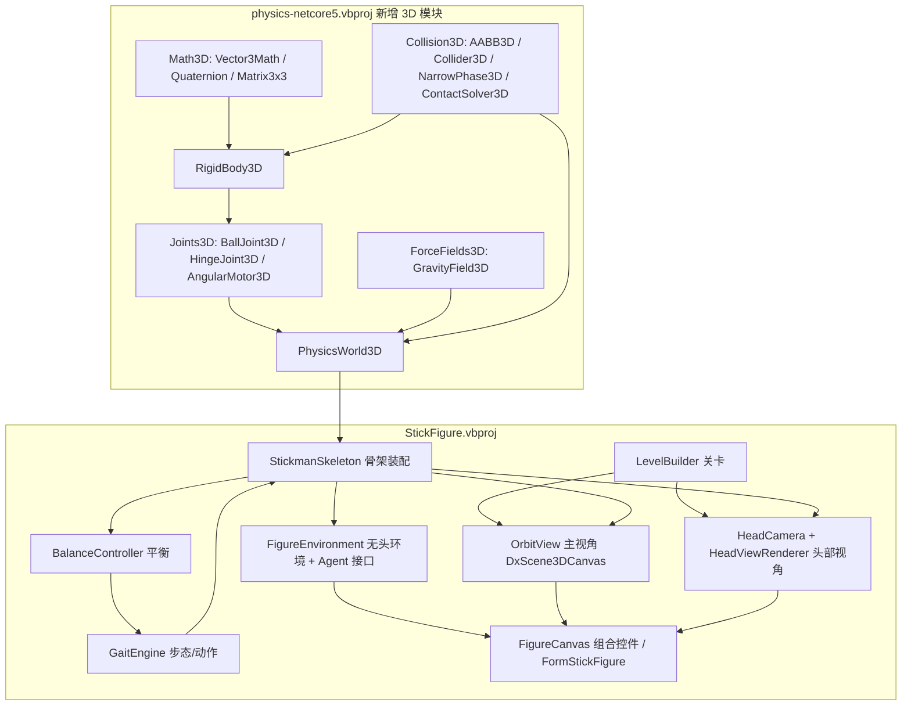

## 产品概述

在 `g:/flywire/src/StickFigure/StickFigure.vbproj`（WinForms，net10.0-windows）中构建一个可交互的 3D 火柴人行走演示程序。火柴人由多个物理刚体与关节构成（头、颈、胸、骨盆、双臂上下臂、双腿大腿/小腿/脚掌），在带重力场的三维关卡中通过调节关节姿态克服重力、保持站立并实现行走、转向、跳跃、跨越障碍、上台阶等动作。

## 核心功能

- **3D 物理角色**：15 个刚体 + 11 个关节（颈、腰、双肩、双肘、双髋、双膝、双踝），球窝/铰链约束 + 角度马达（PD）驱动，重力场作用于全身，角色可真实失稳跌倒。
- **平衡与运动控制**：躯干直立 PD、骨盆高度维持、支撑/摆动腿判定，使角色靠关节姿态克服重力避免瘫倒。
- **预设动作演示**：站立、向前行走、加速跑、左/右转向、原地与助跑跳跃、跨越低矮障碍、上台阶；既可由按钮手动触发，也可由"自动演示"脚本按序列连续播放。
- **双视角交互查看**：
- 主视角：可自由旋转/平移/缩放（鼠标左键轨道、右键平移、滚轮缩放）观察整个三维场景中的火柴人；
- 头部视角：从火柴人头部出发的第一人称画面，可实时观察角色当前所见。
- **神经网络接入接口（预留）**：
- 连续控制：`GetObservation()` 返回关节局部坐标/速度、躯干姿态、骨盆高度、双足触地、朝向误差等浮点向量；`SetAction(Single())` 由网络输出各关节目标角度偏移；
- 视觉输入：`GetVisionFrame()` 返回头部视角 `Bitmap`，`GetVisionGray(w, h)` 返回可配分辨率的灰度 `Byte()` 张量；
- 离散控制：`Act(actionIndex)` 直接触发预设动作；
- 无头训练：`FigureEnvironment` 不依赖任何 WinForms 类型，可脱离界面循环 `Step(dt)`。
- **关卡场景**：地面、低矮障碍物（跨越用）、3~5 级台阶（攀爬用）、地面网格参照线。

## 技术栈选型

- **语言/框架**：VB.NET，SDK 风格项目。physics 库 `net10.0`（非 Windows）；StickFigure `net10.0-windows` + `UseWindowsForms=True`（已配置，无需改 vbproj 引用）。
- **物理**：扩展 `G:\GCModeller\src\runtime\sciBASIC#\gr\physics\physics-netcore5.vbproj`，新增 3D 刚体子模块（用户已确认）。
- **渲染**：`Microsoft.VisualBasic.Drawing.DirectX`（DXApi：D3D11 场景管线 + D2D 离屏画布；DxCanvas：`DxScene3DCanvas` / `DxCanvas` 控件）。
- **3D 数学**：`Microsoft.VisualBasic.Imaging.Drawing3D`（`Point3D` / `Surface`）+ 项目内自建轻量 `Vec3` 结构（避开 `Point3D` 运算符不全、`Operator =` 与标量比较的坑）。

## 实现方案

### 总体策略

分两阶段：先在 physics 库中补齐一套与现有 2D 实现**同风格、同命名习惯**的 3D 刚体/关节/碰撞/世界模块；再在 StickFigure 中用该模块搭建火柴人骨架、控制器、关卡、双视角渲染与神经网络接口。

### 关键技术决策与理由

1. **扩展 physics 库而非在 demo 内自建内核**（用户选择）：3D 刚体模块与现有 `RigidBody`/`PhysicsWorld`/`Joints`/`Collision`/`ForceFields` 结构一一对应，便于后续复用到 GCModeller 其他项目；physics 项目为 SDK 风格默认 glob 编译，新增文件自动纳入，无需改 vbproj。
2. **主视角用 `DxScene3DCanvas`，且环境面只加载一次、人物全部走线段**（关键约束）：`Scene.LoadSurfaces` 会把几何按"自身质心"重新居中，且该平移对输入整体平移**不变**（无法预补偿）。因此静态环境三角形 `LoadSurfaces` 一次固定质心 C，人物骨架每帧用 `UpdateConnections(世界坐标线段)`（`LoadLineSegments` 内部减去同一个 C，与面同空间），长距离行走**零漂移**。这也正是"线段骨架"方案的成立依据。
3. **头部视角必须自写针孔投影**：`Drawing3D.Camera` 是欧拉角轨道相机（只有 `AngleX/Y/Z`+`ViewDistance`+`Offset`），`position` 属性渲染路径从不读取，眼点被钉在场景原点、恒看向原点，**无法**表达"眼点=头部位置"。故头部视角在 `DxCanvas.Render` 事件里用自写 view 矩阵 + 透视投影 + 背面剔除 + 画家算法绘制到 `IGraphics`。
4. **取帧走离屏 `DxGraphics`**：`DxGraphics` 有公开构造函数且内部 `DxRenderTarget` 已在构造时 `BeginDraw()`，`GetRasterImage()` 可回读像素；避开"`Snapshot()/CaptureFrame()` 不能在 `Render` 事件内调用"的限制，且神经网络取帧**不需要可见 UI**。
5. **主动 ragdoll 驱动**：球窝/铰链约束保证骨骼不脱臼，`AngularMotor3D`（目标相对四元数 PD + 扭矩限幅）产生关节力矩；`MotorStep()` 必须**在 `PhysicsWorld3D.Step` 之前**调用（与 2D `Stickman` 参考实现一致）。
6. **稳定性**：`Iterations=20`、`Substeps=4`、`FixedDt=1/60`；马达 `MaxTorque` 限幅；检测到跌倒（头部高度低于阈值或躯干倾角超阈值持续 N 帧）自动复位。

### 性能

- 物理：15 刚体 / 11 约束，宽相位用暴力 N² + AABB 剔除（n<40，远低于空间哈希开销），每次子步 O(n+contacts)；4 子步 × 20 迭代 ≈ 每秒 4800 次约束求解，量级可忽略。
- 渲染主视角：线段 < 150 条，`UpdateConnections` 一次 O(n)；GPU 几何按 `Scene.Version` 缓存失效，非每帧重建顶点缓冲。
- 头部视角：三角形 < 400，排序 O(n log n)，D2D 逐面填充；默认 320×240，可配。
- 注意：不要反复调用 `FitView()`（`Scene.m_radius` 会被连线单调放大）。

## 实现要点（执行细节）

- 命名空间：`RigidBody3D` / `PhysicsWorld3D` / `Vector3` 放根命名空间 `Microsoft.VisualBasic.Imaging.Physics`；新增子模块放 `.Math3D` / `.Collision3D` / `.Joints3D` / `.ForceFields3D`，**避免与既有 2D 类型重名**。
- physics 项目 `GenerateDocumentationFile=True` → 公开成员补 XML 注释，避免大量警告。
- physics 项目**不引用 imaging.NET5**，3D 模块内只能用本库 `Vector3`（引用类型，字段 `x/y/z`），不能用 `Point3D`。
- 复用现成资产：既有 `Vector3`（`Particles\Vector3.vb`）、`PhysicsMaterial`（`RigidBody\PhysicsMaterial.vb`）、`Grid3D`（可选宽相位）；照抄 2D 风格（`PhysicsWorld.StepSub` 八步顺序、`RevoluteJoint` 的 `k = ΣInvMass + ΣInvInertia·rn²`、`j = -vn/k`、Baumgarte `corr = err*0.2`）。
- `DxScene3DCanvas` 无内置渲染循环 → 宿主挂 `System.Windows.Forms.Timer`，Tick 中对**控件本身** `Invalidate()`。
- 统一关闭内置 `ShowGround`，改用自建地面网格线，保证主视角与头部视角视觉一致。
- 面颜色只认 `SolidBrush`；`Surface` 顶点数 ≥ 3。
- 跟随视角实现：每帧 `TryProjectPoint(人物世界坐标, screen)`，然后 `camera.Offset += 屏幕中心 - screen`（屏幕空间一次收敛）。
- 参考实现（仅借鉴算法，不照抄 2D API）：`...\DeepQNetwork\Demo\Stickman.vb` / `StickmanEnv.vb`（`Pivot` 关节 PD、`MotorStep` 先于 `world.Step`）。

## 架构设计



## 目录结构

### 阶段 A：physics 库新增 3D 模块（`G:\GCModeller\src\runtime\sciBASIC#\gr\physics\`）

```
gr\physics\
├── Math3D\
│   ├── Vector3Math.vb      # [NEW] Public Module，镜像 Vector2Math：Dot/Cross/Length/Normalize/Distance/Rotate/Perpendicular/Lerp
│   ├── Quaternion.vb       # [NEW] 四元数：Identity/FromAxisAngle/FromForwardUp/ToMatrix3x3/Rotate/Normalize/Conjugate/Inverse/ToAxisAngle/Slerp/Integrate(omega,dt)
│   └── Matrix3x3.vb        # [NEW] 3x3 矩阵：乘法、转置、求逆、与向量乘；用于惯性张量与世界系逆惯量 R·I⁻¹·Rᵀ
├── Collision3D\
│   ├── AABB3D.vb           # [NEW] Structure：min/max/Center/Extents/Overlaps/Contains/Union
│   ├── Collider3D.vb       # [NEW] MustInherit 基类 + SphereCollider3D / BoxCollider3D / CapsuleCollider3D(线段+半径) / PlaneCollider3D；ComputeInertia(mass) As Matrix3x3、GetAABB(pos, quat)
│   ├── Manifold3D.vb       # [NEW] 接触流形：Normal/Penetration/Contacts()/Restitution/Friction/InitSolver
│   ├── NarrowPhase3D.vb    # [NEW] sphere-sphere / sphere-plane / capsule-plane / sphere-box / capsule-box（最近点法）；静态-静态对跳过
│   ├── BroadPhase3D.vb     # [NEW] AABB 重叠剔除 + 暴力配对，输出 BodyPair3D 列表
│   └── ContactSolver3D.vb  # [NEW] 顺序冲量：法向（Baumgarte + 恢复）+ 两条切线摩擦冲量
├── RigidBody3D\
│   └── RigidBody3D.vb      # [NEW] Position/Orientation(Quaternion)/Velocity/AngularVelocity/Mass/InertiaLocal(Matrix3x3)/阻尼/IsStatic/Material；
│                            #      ApplyForce/ApplyForceAtPoint/ApplyTorque/ApplyImpulse、IntegrateVelocity(dt)（四元数积分后归一化）、
│                            #      IntegratePosition(dt)、ClearForces、SetStatic、GetAABB、ToWorld/ToLocal、InvInertiaWorld
├── Joints3D\
│   ├── IConstraint3D.vb    # [NEW] SolveVelocity(dt) / SolvePosition(dt)
│   ├── BallJoint3D.vb      # [NEW] 三轴点约束（局部锚点重合）+ 可选锥角限位
│   ├── HingeJoint3D.vb     # [NEW] 球窝 + 锁定两旋转轴（膝/肘用）
│   └── AngularMotor3D.vb   # [NEW] 核心：目标相对四元数 PD 马达，τ = Kp·axis·angle − Kd·(ωB−ωA)，MaxTorque 限幅，对 A/B 施等大反向扭矩
├── ForceFields3D\
│   ├── ForceField3D.vb     # [NEW] MustInherit，Region As AABB3D?，MustOverride Apply(bodies)
│   └── GravityField3D.vb   # [NEW] Gravity As Vector3，施加 F = m·g
└── PhysicsWorld3D.vb       # [NEW] 与 PhysicsWorld 同构：Bodies/Constraints/ForceFields/Gravity/Iterations/FixedDt/Substeps/
                             #      Step(frameDt)/Add 重载/工厂 Box(w,h,d,mass)、Sphere(r,mass)、Capsule(len,r,mass)、StaticPlane(normal,offset)
```

### 阶段 B：StickFigure demo（`g:/flywire/src/StickFigure/`）

```
src/StickFigure/
├── Core\
│   └── Vec3.vb                  # [NEW] 轻量 Structure：+ − *(标量) / 运算符、Dot/Cross/Length/Normalize、ToPoint3D()；
│                                 #      规避 Point3D 运算符缺失与 Operator =(Point3D, Single) 误用
├── Simulation\
│   ├── StickmanSkeleton.vb      # [NEW] 15 刚体 + 11 关节装配（Build(world3d, 位置, 朝向)）、关节马达表、SkeletonLines() 取骨架线段、
│                                 #      MotorStep() 施加 PD 力矩、IsFallen 判定、Reset()
│   ├── StickmanPose.vb          # [NEW] 姿态数据结构：各关节目标相对四元数（休息姿态 + 步态增量叠加）
│   ├── BalanceController.vb     # [NEW] 躯干直立 PD、骨盆高度弹簧、支撑/摆动腿判定、质心-支撑面补偿
│   ├── GaitEngine.vb            # [NEW] 相位驱动步态发生器：Stand/Walk/Run/Turn/Jump/StepOver/ClimbStairs/Stop，
│   │                            #      输出当帧 StickmanPose；转向由左右腿步幅差实现
│   └── ActionDirector.vb        # [NEW] ActionPreset 枚举 + 自动演示脚本（动作/时长序列）与手动触发
├── World\
│   ├── LevelMesh.vb             # [NEW] 静态几何容器：三角形(顶点+颜色)、网格线；供两种渲染器共用
│   └── LevelBuilder.vb          # [NEW] 构建关卡：静态地面 PlaneCollider3D、低矮障碍、3~5 级台阶、地面网格线
├── Rendering\
│   ├── FigureVisual.vb          # [NEW] 骨架 → LineSegment()：骨骼线、头部三正交圆环线框、关节十字标记、左右肢体配色
│   ├── OrbitView.vb             # [NEW] 封装 DxScene3DCanvas：环境面一次 LoadSurfaces、每帧 UpdateConnections、
│   │                            #      跟随视角（TryProjectPoint + camera.Offset 补偿）、FitView 初始化
│   ├── HeadCamera.vb            # [NEW] 针孔相机：Eye/Target/Up、FOV、宽高、Near/Far、WorldToView、ViewToScreen、近平面裁剪
│   └── HeadViewRenderer.vb      # [NEW] 用 IGraphics 绘制：背面剔除 + 画家算法排序 + Lambert 明暗；
│                                 #      Draw(g) 画到可见 DxCanvas；Capture(w,h) 用离屏 DxGraphics 取 Bitmap / 灰度 Byte()
├── Agent\
│   ├── Observation.vb           # [NEW] 观测结构：关节局部坐标/速度、躯干 up/forward、骨盆高度、双足触地、朝向误差、视觉帧
│   ├── IStickmanAgent.vb        # [NEW] Function Act(obs As Observation) As Single()
│   └── FigureEnvironment.vb     # [NEW] 无头环境门面：Reset()/Step(dt)/Act(index)/SetAction(Single())/
│                                 #      GetObservation()/GetVisionFrame()/GetVisionGray(w,h)/IsFallen/Position；不含 WinForms 类型
├── UI\
│   ├── FigureCanvas.vb          # [MODIFY] 代码构建 SplitContainer：左=主视角、右=头部视角 + 控制面板
│   │                            #          （行走/跳跃/跨越/上台阶/左转/右转/停止/重置/自动演示、速度滑杆、跟随开关、状态标签）；
│   │                            #          Timer 驱动物理步进与两侧重绘
│   └── FormStickFigure.vb       # [MODIFY] 仅承载 FigureCanvas1，保留设计器文件不动
└── StickFigure.vbproj           # 无需修改（引用已齐备）
```

## 关键代码结构

```
' physics: Joints3D\IConstraint3D.vb 与核心马达（新增 3D 模块的地基）
Namespace Joints3D
    Public Interface IConstraint3D
        Sub SolveVelocity(dt As Double)
        Sub SolvePosition(dt As Double)
    End Interface

    ''' 目标相对姿态 PD 马达：驱动火柴人各关节克服重力的核心执行器
    Public Class AngularMotor3D : Implements IConstraint3D
        Public A As RigidBody3D
        Public B As RigidBody3D
        ''' B 相对 A 的目标朝向
        Public Property TargetRelative As Quaternion
        Public Property Stiffness As Double      ' Kp
        Public Property Damping As Double        ' Kd
        Public Property MaxTorque As Double = 0  ' 0 = 不限幅
        Public Sub ApplyTorques(dt As Double)   ' 由 MotorStep 调用
    End Class
End Namespace
```

```
' StickFigure: 面向神经网络的无头环境门面（不含任何 WinForms 类型）
Public Class FigureEnvironment
    Public Sub New(Optional level As LevelBuilder = Nothing)
    Public Sub Reset(Optional seed As Integer = 0)

    ''' 无头训练主循环接口
    Public Sub [Step](dt As Double)
    ''' 连续控制：由神经网络输出各关节目标角度偏移
    Public Sub SetAction(action As Single())
    ''' 离散控制：直接触发预设动作
    Public Sub Act(actionIndex As Integer)
    ''' 观测（关节局部坐标/速度、躯干姿态、骨盆高度、双足触地、朝向误差）
    Public Function GetObservation(Optional withVision As Boolean = False) As Observation
    ''' 头部视角画面（分辨率可配）
    Public Function GetVisionFrame(Optional w As Integer = 320, Optional h As Integer = 240) As Bitmap
    Public Function GetVisionGray(Optional w As Integer = 84, Optional h As Integer = 84) As Byte()
    Public ReadOnly Property IsFallen As Boolean
End Class

Public Interface IStickmanAgent
    Function Act(obs As Observation) As Single()
End Interface
```

## 应用类型

Windows 桌面 WinForms 应用（`net10.0-windows`），面向桌面大屏单窗口布局，非移动端。

## 设计风格

深色工程/仿真控制台风格（深色底 + 高饱和强调色 + 半透明信息条），强调"可观察、可调参、可扩展"，信息密度较高但分区清晰。避免花哨装饰，以清晰的层次与稳定的色彩语义为主。

## 页面规划（单窗口 `FormStickFigure` → `FigureCanvas`）

### 区块 1：顶部工具栏

标题"3D 火柴人物理仿真 Demo" + 全局状态条（当前动作、仿真时间、FPS、跌倒状态徽标）+ 视角工具按钮（重置视角 / 贴合视图 / 截图）。

### 区块 2：左侧主视角区（约占 65% 宽）

`DxScene3DCanvas` 铺满，深蓝灰渐变背景，内置地面网格线；鼠标左键轨道旋转、右键平移、滚轮缩放；渲染火柴人线段骨架（左肢/右肢分色）、头部三正交圆环线框、关节十字标记、静态台阶与障碍实体面。右上角叠加半透明 HUD：骨盆高度、水平速度、躯干倾角。

### 区块 3：右侧头部视角区（右上，约 35% 宽）

`DxCanvas` 自绘第一人称画面，固定 4:3；底部标注"HEAD VIEW / 神经网络输入源"；右上角显示当前取帧分辨率。

### 区块 4：右侧控制面板（右下）

两列按钮组：动作（站立 / 行走 / 奔跑 / 左转 / 右转 / 跳跃 / 跨越障碍 / 上台阶 / 停止 / 重置）；演示（自动演示 播放·暂停、脚本进度）。滑杆：行走速度、转向速率、马达刚度 Kp、阻尼 Kd、重力强度。开关：跟随视角、显示关节标记、显示骨架线、视觉取帧开关（含 84×84 / 160×120 / 320×240 三档）。

### 区块 5：底部状态栏

当前动作与相位、左/右足触地指示、质心投影偏差、物理迭代次数、环境物体数、接口提示（"Agent 接口：GetObservation / SetAction / Act / GetVisionGray"）。

## 交互

- 动作按钮即时切换 `GaitEngine` 状态；自动演示按脚本序列推进并高亮当前动作。
- 视角区鼠标交互由 `OrbitCameraController` 提供；跟随开关打开时相机自动把火柴人保持在画面中心。
- 跌倒时顶部徽标转为警示色，并在达到阈值后自动复位。
- 参数滑杆实时热更新物理参数，无需重启仿真。

## 响应式

窗口缩放时 `SplitContainer` 按比例分配；主视角 `Dock=Fill` 并在 `Resize` 时 `UpdateViewport()`；头部视角保持 4:3 并居中留边；面板最小宽度受限以保证按钮组不折行。

## Agent Extensions

### SubAgent

- **code-explorer**
- 用途：在实现每个阶段前，核对 physics 库既有 2D 实现（`PhysicsWorld.vb`、`RigidBody\RigidBody.vb`、`Joints\RevoluteJoint.vb`、`Collision\ContactSolver.vb`、`ForceFields\GravityField.vb`）与 `DxScene3DCanvas` / `Scene` / `DxGraphics` 的真实签名，确保新增 3D 模块与调用代码编译通过、不臆造 API。
- 预期结果：拿到准确的成员签名、命名空间与调用约束，避免编译期与运行期返工。