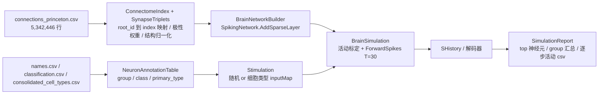

## 需求概述

在 `src/FlywireAI/FlywireAI.vbproj` 中新增「果蝇全脑连接组 → SNN 脉冲神经网络」模块：基于已有 FAFBv783 数据加载代码读取 `F:\flywire\FAFB-v783` 的突触连接数据，构建可运行的果蝇大脑脉冲神经网络并用 SNN 模型实际运行仿真。

## 核心功能

- **连接组加载与索引化**：流式读取 `connections_princeton.csv`（5,342,446 行，字段 `pre_root_id, post_root_id, neuropil, syn_count, nt_type`），把全脑 139,255 量级的神经元 root_id（约 7.2e17，必须用 Int64）映射为 `[0, N)` 连续索引，输出 `pre[] / post[] / weight[]` 三元组并保证可反查回 root_id。
- **突触极性建模**：按 `nt_type` 区分兴奋/抑制（GABA 类为负权重，GLUT/ACH 等为正），形成 E/I 平衡网络；权重强度来自 `syn_count`，并做结构归一化（按突触后神经元输入强度缩放）以保证膜电位量级可控。
- **SNN 网络装配**：用 SNN 库的稀疏递归 LIF 路径（`SpikingNetwork.AddSparseLayer` + `ForwardSpikes`）装配全脑网络，含层内循环连接与自反馈；网络构建后打印规模、权重统计（min/max/mean/NaN 检查）。
- **两种可切换的外部驱动**：① 随机脉冲刺激一批神经元；② 按细胞类型/group 定点刺激（用 `inputMap` 把少量输入特征注入指定神经元）；demo 分别运行并对比结果。
- **仿真运行与活动报告**：固定种子、T=30，逐时间步推进并打印进度与耗时；输出总脉冲数、活跃神经元数、平均发放率、逐步活跃曲线，以及按 cell type / group 汇总的 top 放电列表，并落盘 csv。
- **运行稳定性保障**：内置短时探针式的活动标定（自动选取全局增益使活跃比例落在合理区间），避免出现全静默或全脑同步爆发。

## 技术栈

- 语言/框架：VB.NET（net10.0），目标工程 `src/FlywireAI/FlywireAI.vbproj`（`RootNamespace = FlywireAI`），新代码命名空间建议 `FlywireAI.Connectome`。
- 复用既有工程引用（无需新增依赖，vbproj 已包含）：
- SNN 库：`Microsoft.VisualBasic.DeepLearning.SpikingNeuralNetwork`（`SpikingNetwork` / `SparseLIFLayer` / `SparseMatrix` / `SpikeEncoders` / `SpikeDecoders`）
- 张量库：`Microsoft.VisualBasic.MachineLearning.TensorFlow.Tensor`
- 数据框架：`Microsoft.VisualBasic.Data.Framework`（`LoadCsv` / `DataStream.OpenHandle` + `AsLinq`）
- 复用既有加载与模型代码：`FlywireAI.FAFBv783` 下的 `FAFBv783Loader`（`LoadXxx` / `StreamXxx`）与 `Connections`（`PreRootId As Long` / `PostRootId As Long` / `Neuropil` / `SynCount As Double` / `NtType`）、`CellNames`、`Classification`、`CellTypes`、`Neurons`、`CellStats`。
- 工程为 SDK 风格，新增 `**/*.vb` 自动纳入编译，**不需要修改 vbproj**。

## 实现方案

**总体策略**：三阶段流水线「连接组 → 稀疏权重组装 → 脉冲仿真」，把数据读取（复用既有 loader）、索引与权重构造、网络装配、驱动输入、仿真与报告各自独立成文件，便于调参与复用。

**关键决策与理由**：

1. **单遍流式索引 + 两遍数组构建**：第一遍 `StreamConnections()` 流式扫描，按出现顺序把 root_id 动态分配为索引并缓存 `pre/post/weight`（`List(Of Integer)` / `List(Of Double)` 预分配容量），同时累计每个突触后神经元的输入强度用于结构归一化。全程不把 5.34M 行常驻内存（只驻留扁平数组：`pre/post` 各约 21 MB、`weight` 约 43 MB），并避免把 `Connections` 对象堆进内存。首遍顺序固定即结果可复现。
2. **极性 + 结构归一化自行实现**（不依赖框架 `SparseMatrix.Normalize` 在符号混杂时的列缩放语义）：`w = polarity(nt_type) × syn_count / Σ|syn_count|(post)`，再乘可调全局增益 `g`。这样「全部突触前同时发放」时单个神经元的净驱动约为 ±g，配合 `threshold`/`beta` 语义清晰，也便于用 `SparseNormalization.None` 直传 `AddSparseLayer`；实现中对权重做 NaN/Inf 校验并打印统计。
3. **重复 (pre, post) 由框架合并**：连接表是 per-neuropil 行，同一对细胞可能多行；`SparseMatrix.FromTriplets` 会按 `(pre, post)` 累加合并（正合需求，等价于「该细胞对的突触总数」），报告中因此区分 `csv rows` 与 `nnz`。
4. **用 `inputMap` 做定点驱动**：`inputSize` = 刺激神经元数 M（默认 5,000，远小于 N），`inputMap` 给出这 M 个特征注入的网络索引，符合库的约束（`inputMap.Length = inputSize`、索引 ∈ [0, N)），并避免构造 139k 宽的输入张量。
5. **活动标定（避免全静默/全爆发）**：先用 `T=8` 的小探针在若干候选增益（如 1、2、4、8）上跑一遍，选活跃比例最接近目标带（默认 1%–30%）的增益作为正式仿真的 `g`；标定过程打印每个候选的活跃比例与耗时。标定与正式运行共用同一网络对象（`ForwardSpikes` 内部自动重置状态），无需重建网络。
6. **两种驱动可切换**：`StimulationMode` 枚举（`RandomNeurons` / `CellType`），由 `SnnConfig` 控制；细胞类型模式依据 `CellNames.Group`、`Classification.SuperClass/[Class]`、`CellTypes.PrimaryType` 建立的每神经元注释表筛选刺激源（缺注释的神经元可回退为 group 名称空串）。
7. **报告落盘格式固定**：`simulation_summary.csv`（配置 + 标定增益 + 耗时 + 全局指标）、`top_neurons_<mode>.csv`（root_id, name, group, primary_type, spike_count, firing_rate）、`group_activity_<mode>.csv`（group, neurons, active, total_spikes, mean_rate）、`per_step_activity_<mode>.csv`（step, active_neurons, total_spikes）。

**性能与可靠性**：

- 复杂度：SpMM 每步 `O(nnz)`，整段仿真 `O(T × nnz)`；nnz 约 5.3M 级（合并后略低），CSR 预计 60–85 MB，属该库设计目标规模（readme 明确「FlyWire 量级用 CSR 是唯一可行选择」）。CPU SpMM 会跳过零源，实际耗时取决于每步活跃突触数，故必须逐时间步打印进度与耗时。
- 内存：`pre/post/weight` 数组 + CSR + `SHistory`（T=30 时 `[1, N]` × 30 ≈ 33 MB）均在可控范围；不构造任何 N×N 稠密矩阵（`ToDense()` 严禁调用）。
- 可靠性：仿真前做权重与索引合法性检查（NaN/Inf、越界、孤立神经元计数）；仿真后检查 `SHistory.Count = T`、脉冲计数无 NaN、活跃神经元的比例落在标定靶带内；所有文件读取使用既有 `Using` 语义（流式枚举期间完成物化）。

## 实施要点

- **CellNames/Classification/CellTypes 只加载一次**（`LoadCellNames()` / `LoadClassification()` / `LoadCellTypes()`，各约 14 万行），按 root_id 建索引后映射到网络索引，用于刺激选择与报告聚合。
- **确定性**：网络 `Rng` 固定种子；刺激神经元子集用固定种子的 `Random` 抽取；输入编码统一走 `SpikeEncoding.RateCoding`（`net.Rng` 参与）或可选 `DirectCurrent`（无随机性，便于复现），由配置项切换。
- **刺激强度**：输入张量取值 `[0,1]`，默认 0.9 恒定（RateCoding 下即高发放率脉冲串）；细胞类型模式下若匹配神经元数超过上限则按种子抽样截断，并记录实际 M。
- **进度与日志**：每 5 步打印 `step / T`、本步活跃神经元数、累计脉冲数、耗时；仿真结束打印吞吐（步/秒）与 ETA 校核；不做逐行日志刷屏。
- **输出目录**：`SnnConfig.OutputDir` 默认 `F:\flywire\FAFB-v783\snn-output\<yyyyMMdd_HHmmss>\`，目录不存在则创建；文件名与列定义固定（便于 demo 断言文件存在且行数 > 0）。
- **不修改既有代码语义**：仅新增文件；对 `src/test/Program.vb` 追加第 9 段 demo（沿用既有 `run` / `check` / `csv` 辅助函数与 pass/fail 汇总风格）。

## 架构设计



## 目录结构

```
src/FlywireAI/Connectome/
├── ConnectomeIndex.vb      # [NEW] 神经元索引与注释表：root_id ↔ index 双向映射（Long key），N 规模统计；从 CellNames/Classification/CellTypes 建立每神经元的 group/class/primary_type/nt_type 注释数组，供刺激筛选与报告聚合（缺注释用空串并计数）
├── SynapseTriplets.vb      # [NEW] 连接组读取与权重构造：流式扫描 Connections，动态分配索引，输出 pre/post/weight 数组；按 nt_type 判定极性（GABA 负、其余正），按突触后输入强度做结构归一化，应用全局增益；提供权重统计（min/max/mean/负权重条数/NaN 检查）与 csv 行数 vs nnz 统计
├── SnnConfig.vb            # [NEW] 仿真配置：数据目录、连接文件名、T、beta、threshold、resetMode、encoding、normalization(None)、兴奋/抑制增益、标定开关与候选增益、刺激模式与刺激神经元数/强度/种子、输出目录与文件名模板；含 ToString 摘要用于报告
├── BrainNetworkBuilder.vb  # [NEW] 网络装配：由三元组构建 SparseMatrix/调用 AddSparseLayer 生成 SpikingNetwork；打印 N/nnz/权重统计；暴露 net 与 N 供仿真使用
├── Stimulation.vb          # [NEW] 输入构造：随机神经元子集 / 按 group 与 class 与 primary_type 筛选两类模式，产出 inputMap（Integer()）与输入张量 [1, M]；记录所选神经元的 root_id 列表以便报告
├── BrainSimulation.vb      # [NEW] 仿真运行：短探针活动标定选择全局增益，再执行 T 步 ForwardSpikes；逐 5 步打印 step/活跃数/累计脉冲/耗时；输出全局指标（总脉冲、活跃神经元、平均发放率、静默比例）与 SHistory
└── SimulationReport.vb     # [NEW] 报告与落盘：统计 top-K 放电神经元（附 root_id/name/group/primary_type），按 group 与 primary_type 聚合活动，导 出 per-step 活动；写 simulation_summary.csv / top_neurons_<mode>.csv / group_activity_<mode>.csv / per_step_activity_<mode>.csv
src/test/Program.vb         # [MODIFY] 追加第 9 段 demo：两种驱动模式各跑一次全脑仿真，断言规模/权重/NN/活动/落盘结果
```

## 关键代码结构

```
' SnnConfig.vb —— 仿真配置（interface 级定义）
Public Enum StimulationMode
    RandomNeurons = 0
    CellType = 1
End Enum

Public Class SnnConfig
    Public Property DataDir As String = "F:\flywire\FAFB-v783"
    Public Property ConnectionsCsv As String = "connections_princeton.csv"
    Public Property TimeSteps As Integer = 30
    Public Property Beta As Double = 0.9
    Public Property Threshold As Double = 1.0
    Public Property Encoding As SpikeEncoding = SpikeEncoding.RateCoding
    Public Property ExcitatoryGain As Double = 1.0
    Public Property InhibitoryGain As Double = 1.0
    Public Property GlobalGain As Double = 0.0          ' <=0 表示由活动标定自动决定
    Public Property CalibrationProbeSteps As Integer = 8
    Public Property CalibrationCandidates As Double() = {1.0, 2.0, 4.0, 8.0}
    Public Property TargetActiveFraction As Double = 0.05
    Public Property Seed As Integer = 42
    Public Property Mode As StimulationMode = StimulationMode.RandomNeurons
    Public Property StimulationNeurons As Integer = 5000
    Public Property StimulationValue As Double = 0.9
    Public Property TargetGroup As String = ""           ' CellType 模式使用的筛选条件
    Public Property TargetClass As String = ""
    Public Property TargetPrimaryType As String = ""
    Public Property OutputDir As String
End Class

' BrainSimulation.vb / SimulationReport.vb —— 运行与报告入口（interface 级定义）
Public Function CalibrateGain(network As SpikingNetwork, config As SnnConfig, probe As Tensor) As Double
Public Function RunSimulation(network As SpikingNetwork, config As SnnConfig, stim As Stimulation) As BrainSimulationResult
Public Function WriteReports(result As BrainSimulationResult, config As SnnConfig, index As ConnectomeIndex) As String()
```

## 验证方式

1. 编译：`dotnet build .\flywire.slnx -c Debug -p:Platform=x64`，要求 0 warning / 0 error（含 IDE 诊断）。
2. 运行 demo（真实数据 `F:\flywire\FAFB-v783`），断言项：

- 索引规模：`N` 与 `names.csv` 唯一 root_id 数量在合理区间（打印两者并断言 `N > 130000`，不硬编码易失效的精确值）；索引双向映射往返一致（抽样校验）。
- 权重：无 NaN/Inf；负权重条数 > 0（GABA 存在）；`nnz <= csv 行数` 且 `nnz > 1000000`；打印 min/max/mean 与按极性的条数分布。
- 网络：`SparseLayer.Units = N`；`SHistory.Count = T`；脉冲计数无 NaN。
- 活动：标定后活跃神经元比例落在 `[1%, 30%]`（打印实测值）；总脉冲数 > 0；两种驱动模式的活跃规模不同（对比打印）。
- 落盘：4 类 csv 文件存在且行数 > 0（`top_neurons` 行数 = top-K；`per_step_activity` 行数 = T）。

3. 运行耗时与吞吐打印（每步/整体），确认全脑规模单次仿真在可接受时间内完成（数十秒至数分钟级），避免误判卡死。

## Agent Extensions

### SubAgent

- **code-explorer**
- Purpose: 在实现阶段复核 SNN 库与 Tensor 的若干关键细节，避免因 API 语义误判导致返工，具体包括：`Tensor` 的构造/就地写入（`Data` 与 `MarkHostModified()`）与稀疏张量相关接口、`SparseMatrix.Values` 是否可外部就地改写、`SparseLifLayer` 与 `SpikeDecoders` 在 batch=1 场景下的输出形状与轨迹访问方式。
- Expected outcome: 得到逐字的方法签名与最小可用调用片段（含默认参数与形状约束），据此确定 `SynapseTriplets` 的权重写入方式与 `BrainSimulation` 的解码路径，无需在编译-报错循环中试错。