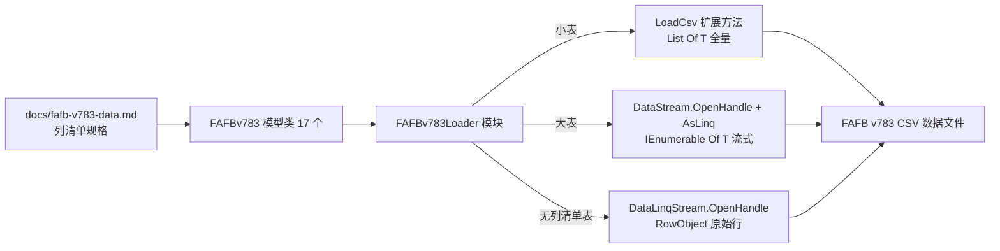

## 需求概述

按照 `docs/fafb-v783-data.md`（FAFB v783 下载页转换而来的表格格式说明）中的内容，在 `src/FlywireAI/FAFBv783/` 目录下生成每张表格对应的 VB.NET 数据模型类，并提供集中式的数据加载方法。

## 核心功能

- **数据模型类**：文档中共 17 张带列清单的表格，每张表对应一个模型类文件，属性与 CSV 列一一对应（列名含空格、括号、VB 关键字时必须使用列别名属性），字段类型按文档类型提示映射。
- **常规加载**：通过扩展方法 `LoadCsv(Of T)` 泛型方法把 `*.csv` 全量加载为 `List(Of T)`。
- **超大表流式加载**：通过 `DataStream.OpenHandle` + `AsLinq(Of T)` 以惰性迭代方式加载（Synapse Table 8021 万行、Connections Unfiltered 2228 万行、Synapse Coordinates 3415 万行等），避免一次性读入内存。
- **集中式加载器**：加载方法不写在模型类内，统一放在 `FAFBv783Loader` 扩展方法模块中，每张表提供 `LoadXxx`（全量）与 `StreamXxx`（流式）两个方法。
- **无列清单表兜底**：`synapse_attachment_rates.csv.gz` 文档未给出列清单，提供基于表头 + `RowObject` 的原始行流式读取方法；`Neuron Skeletons` 为 zip/SWC 归档（非表格），不建模型。

## 已确认约束

- 321 列的 `Per Neuropil Connection And Synapse Counts` 表需完整生成全部 321 个属性。
- 组织方式为「每表一个 .vb 文件」，文件名与类名一致。
- 加载方法集中在 `FAFBv783Loader` 模块中。
- 数值字段统一使用 `Double`。

## 技术栈

- 语言/框架：VB.NET（net10.0），`src/FlywireAI/FlywireAI.vbproj`，`RootNamespace = FlywireAI`
- 复用的既有框架（已作为 ProjectReference 引用，无需新增依赖）：
- `Microsoft.VisualBasic.Data.Framework`（DataFrame/CSV 反射存储提供者）
- `Microsoft.VisualBasic.Core`
- 使用的类型与命名空间（已核实）：
- `Microsoft.VisualBasic.Data.Framework.Extensions`（`LoadCsv` 扩展方法所在模块）
- `Microsoft.VisualBasic.Data.Framework.StorageProvider.Reflection`（`&lt;Column("列名")&gt;` 别名属性）
- `Microsoft.VisualBasic.Data.Framework.IO.Linq`（`DataStream`、`DataLinqStream`）
- `Microsoft.VisualBasic.Data.Framework.IO`（`RowObject`）
- 生成的代码命名空间统一为 `FlywireAI.FAFBv783`
- 无需修改 `FlywireAI.vbproj`：SDK 风格工程按 `**/*.vb` 通配自动包含新增文件（`FAFBv783\` 目录已在工程中声明）

## 实现方案

**总体策略**：以文档为唯一规格来源，逐表生成「一文件一类」，属性名保持可读（基本沿用列名风格），每个属性显式标注 `&lt;Column("原始列名")&gt;` 以消除列名合法性与大小写歧义；加载能力集中在 `FAFBv783Loader` 模块，用两套 API 覆盖「小表全量 / 大表流式」两种场景。

**关键决策与理由**：

1. **每列都写 `&lt;Column("...")&gt;` 别名**：文档中存在大量非合法标识符列名（`additional_type(s)`、`class`、`input synapses in AL_L`、`pre_root_id_720575940` 等）。`LoadCsv` 的 `explicit` 默认为 `False`（所有简单属性都会参与映射），别名在两种模式下都会被优先采用，因此显式别名最稳妥。
2. **模型类只包含列属性**：反射存储提供者会把公共简单属性映射为列，若加入计算属性/只读属性会产生额外列并可能触发只读冲突，故除 `ToString` 外不添加任何非列成员；同时保证隐式无参构造函数存在（`AsLinq` 的 `T As {New, Class}` 约束要求）。
3. **大小表分流**：`LoadCsv` 返回 `List(Of T)` 需全量驻留内存；`StreamXxx` 走 `DataStream.OpenHandle(...).AsLinq(Of T)()`，以 `Iterator + Using` 逐行解析，内存占用 O(1)（不含调用方缓存），并在枚举结束/释放时关闭文件句柄。
4. **必要例外：ID 列使用 `Long`（Int64）而非 `Double`**。FlyWire 根 ID 约 7.2×10^17，超过 `Double` 可精确表示的整数上限 2^53≈9.0×10^15，用 `Double` 会静默丢失 ID 精度。故 `root_id`、`pre_root_id`、`post_root_id`、`pre_root_id_720575940`、`post_root_id_720575940`、`supervoxel_id`、`label_id`、`user_id` 等标识列使用 `Long`；文档明确标注 `INT`/`FLOAT` 的度量与计数列一律按你的选择使用 `Double`；文档未标注类型的非 ID 列（`position`、`date_created`、`label`、`type`、`group`、`name`、`hemisphere` 等）使用 `String`。若坚持全部 `Double`，只需替换这些 ID 属性的一行声明。
5. **无列清单表兜底**：`synapse_attachment_rates.csv.gz` 无列定义，使用 `DataLinqStream.OpenHandle` 返回表头 schema + `IEnumerable(Of RowObject)` 原始行，避免臆造列。

**性能与可靠性**：

- 大表规模：Synapse Table 80,215,790 行 / 2.7GB；Synapse Coordinates 34,156,320 行 / 317MB；Connections (Unfiltered) 22,285,323 行 / 277MB；Buhmann 16,847,997 行。这些必须使用 `StreamXxx`，`LoadXxx` 仅在小表上使用。
- 321 列表 × `Double` 的每行约 2.6KB（320×8B），134,181 行全量载入约 340MB，属可接受范围；若后续内存紧张，可把计数列改为 `Integer`（属可选优化，不在本次范围）。
- 输入文件按文档要求为 `gunzip` 解压后的 `.csv`；加载器 XML 注释中标注对应下载文件名与是否推荐流式读取。
- 异常来自框架层（文件不存在、类型转换失败等），加载器不吞异常，仅做无副作用的参数透传。

## 实施要点

**文件与类命名映射**（文件名 = 类名 = `.vb`）：

| 类名 | 文档章节 | 下载文件 | 列数 |
| --- | --- | --- | --- |
| `CellTypes` | Cell Types | consolidated_cell_types.csv.gz | 3 |
| `Classification` | Classification / Hierarchical Annotations | classification.csv.gz | 8 |
| `CellStats` | Cell Size Measurements | cell_stats.csv.gz | 4 |
| `CellNames` | Proofread Cell Names And Groups | names.csv.gz | 3 |
| `Neurons` | Neurotransmitter Type Predictions | neurons.csv.gz | 10 |
| `VisualNeuronTypes` | Visual Neuron Annotations | visual_neuron_types.csv.gz | 6 |
| `ColumnAssignment` | Visual Neuron Columns | column_assignment.csv.gz | 8 |
| `CommunityLabels` | Community Labels (Raw) | labels.csv.gz | 9 |
| `ProcessedLabels` | Community Labels (Refined) | processed_labels.csv.gz | 2 |
| `Connections` | Connections (Filtered) | connections_princeton.csv.gz | 5 |
| `ConnectionsNoThreshold` | Connections (Unfiltered) | connections_princeton_no_threshold.csv.gz | 5 |
| `ConnectionsBuhmannNoThreshold` | Connections Predicted With Buhmann Et. Al.（旧版） | connections_buhmann_no_threshold.csv.gz | 5 |
| `ConnectivityTags` | Connectivity Tags | connectivity_tags.csv.gz | 2 |
| `Coordinates` | Marked Neuron Coordinates | coordinates.csv.gz | 3 |
| `SynapseTable` | Synapse Table | fafb_v783_princeton_synapse_table.csv.gz | 13 |
| `SynapseCoordinates` | Synapse Coordinates（旧版） | synapse_coordinates.csv.gz | 5 |
| `NeuropilSynapseTable` | Per Neuropil Connection And Synapse Counts（旧版） | neuropil_synapse_table.csv.gz | 321 |


**属性命名与别名规则**：

- 列名本身是合法 VB 标识符且非关键字时，属性名沿用列名（如 `root_id`、`pre_x`、`length_nm`、`syn_count`），并仍然写出 `&lt;Column("同名列名")&gt;` 便于对照。
- 列名是 VB 关键字时用方括号标识符：`class` → `Public Property [Class] As String`，别名 `<Column("class")>`。
- 列名非法（含空格/括号）时按「按空格切词 → 各词首字母大写 → 保留 `_L`/`_R` 后缀」生成属性名，并保留原始列名作为别名：
- `additional_type(s)` → `AdditionalTypes`
- `input synapses` → `InputSynapses`；`input partners in AL_L` → `InputPartnersInAL_L`
- `pre_root_id_720575940` → `PreRootId720575940`（别名保留原列名）
- 321 列表必须严格按照文档中 `col 1 … col 321` 的**先后顺序**逐个生成属性，不得合并或重排。
- 每个模型文件顶部 `Imports Microsoft.VisualBasic.Data.Framework.StorageProvider.Reflection`；类上写 `<summary>` 注释（章节名、下载文件名、行数/列数、是否建议使用流式读取）。

**易错点**：

- `additional_type(s)`、`input synapses in ...`、`pre_root_id_720575940` 等列若忘记写别名会导致整列读不到值（静默为默认值），必须逐列核对。
- 属性类型若与 CSV 文本不匹配，反射转换会抛异常；因此 `neuropil`（部分行缺失）等一律用 `String`。
- `AsLinq` 要求 `T` 具有无参构造函数，模型类不要自定义带参构造函数。

## 架构设计



数据流：调用方传 `path` → Loader 依据表类型选择全量或流式方法 → 框架按 `Column` 别名建立 schema 映射 → 逐行（或整表）反射填充模型对象。

## 目录结构

```
src/FlywireAI/FAFBv783/
├── CellTypes.vb                  # [NEW] Cell Types 表模型（3 列：root_id、primary_type、additional_type(s)）。注意 additional_type(s) 必须用列别名
├── Classification.vb             # [NEW] Classification 表模型（8 列：flow、super_class、class、sub_class、hemilineage、side、nerve）。class 为 VB 关键字，用 [Class] + 别名
├── CellStats.vb                  # [NEW] Cell Size Measurements 表模型（4 列：length_nm、area_nm、size_nm 为 INT → Double）
├── CellNames.vb                  # [NEW] Proofread Cell Names And Groups 表模型（3 列：root_id、name、group）
├── Neurons.vb                    # [NEW] Neurotransmitter Type Predictions 表模型（10 列：group、nt_type、nt_type_score 及 6 个 *_avg FLOAT 分数 → Double）
├── VisualNeuronTypes.vb          # [NEW] Visual Neuron Annotations 表模型（6 列：type、family、subsystem、category、side）
├── ColumnAssignment.vb           # [NEW] Visual Neuron Columns 表模型（8 列：hemisphere、column_id、x/y/p/q 为 INT → Double）
├── CommunityLabels.vb            # [NEW] Community Labels (Raw) 表模型（9 列：label、user_id、position、supervoxel_id、label_id、date_created、user_name、user_affiliation）
├── ProcessedLabels.vb            # [NEW] Community Labels (Refined) 表模型（2 列：root_id、processed_labels）
├── Connections.vb                # [NEW] Connections (Filtered) 表模型（5 列：pre_root_id、post_root_id、neuropil、syn_count、nt_type）；534 万行，建议流式
├── ConnectionsNoThreshold.vb     # [NEW] Connections (Unfiltered) 表模型（5 列，同上）；2228 万行，建议流式
├── ConnectionsBuhmannNoThreshold.vb # [NEW] Buhmann 旧版连接表模型（5 列）；1685 万行，建议流式
├── ConnectivityTags.vb           # [NEW] Connectivity Tags 表模型（2 列：root_id、connectivity_tag，逗号分隔多值用 String）
├── Coordinates.vb                # [NEW] Marked Neuron Coordinates 表模型（3 列：root_id、position、supervoxel_id）
├── SynapseTable.vb               # [NEW] Synapse Table 表模型（13 列：pre/ctr/post 的 x/y/z、size、pre_root_id_720575940、post_root_id_720575940、neuropil）；8021 万行，必须流式
├── SynapseCoordinates.vb         # [NEW] Synapse Coordinates 旧版表模型（5 列：pre_root_id、post_root_id、x、y、z；前两列大量为空 → String）
├── NeuropilSynapseTable.vb       # [NEW] Per Neuropil 连接/突触计数表模型（321 列，严格按文档 col 1..321 顺序生成，列名均含空格需全部别名）
└── FAFBv783Loader.vb             # [NEW] 集中加载模块。为上述 17 张表各提供 LoadXxx（LoadCsv 全量）与 StreamXxx（DataStream.OpenHandle + AsLinq 流式）扩展方法；另提供 StreamRaw（DataLinqStream.OpenHandle → RowObject 原始行）用于文档未给列清单的 synapse_attachment_rates.csv.gz；模块级 XML 注释记录 Neuron Skeletons 为 zip/SWC 归档不建模型
```

## 关键代码结构

模型类模板（含别名与类型示例）：

```
Imports Microsoft.VisualBasic.Data.Framework.StorageProvider.Reflection

Namespace FAFBv783

    ''' <summary>
    ''' Cell Types: consolidated_cell_types.csv.gz (138,327 rows, 3 columns)
    ''' </summary>
    Public Class CellTypes

        &lt;Column("root_id")&gt;
        Public Property RootId As Long

        &lt;Column("primary_type")&gt;
        Public Property PrimaryType As String

        &lt;Column("additional_type(s)")&gt;
        Public Property AdditionalTypes As String

    End Class
End Namespace
```

加载器模块模板（全量 + 流式 + 原始行兜底）：

```
Imports System.Runtime.CompilerServices
Imports System.Text
Imports Microsoft.VisualBasic.Data.Framework.Extensions
Imports Microsoft.VisualBasic.Data.Framework.IO
Imports Microsoft.VisualBasic.Data.Framework.IO.Linq

Namespace FAFBv783

    Public Module FAFBv783Loader

        &lt;Extension&gt;
        Public Function LoadCellTypes(path As String,
                                      Optional encoding As Encoding = Nothing,
                                      Optional mute As Boolean = False) As List(Of CellTypes)

            Return path.LoadCsv(Of CellTypes)(encoding:=encoding, mute:=mute)
        End Function

        &lt;Extension&gt;
        Public Iterator Function StreamSynapseTable(path As String,
                                                    Optional encoding As Encoding = Nothing,
                                                    Optional parallel As Boolean = False) As IEnumerable(Of SynapseTable)

            Using handle As DataStream = DataStream.OpenHandle(path, encoding)
                For Each row As SynapseTable In handle.AsLinq(Of SynapseTable)(parallel)
                    Yield row
                Next
            End Using
        End Function

        &lt;Extension&gt;
        Public Function StreamRaw(path As String, Optional encoding As Encoding = Nothing) As IEnumerable(Of RowObject)
            Dim handle = DataLinqStream.OpenHandle(path, encoding)
            Return handle.table
        End Function

    End Module
End Namespace
```

## 验证方式

1. 编译 `src/FlywireAI/FlywireAI.vbproj`（`dotnet build -c Debug -p:Platform=x64`），要求 0 error；同时检查 IDE 诊断无新增警告。
2. 冒烟验证（在已有 `src/test` 工程中临时进行，验证后可保留或还原）：在临时目录写入若干小样例 CSV（表头使用文档中的真实列名，重点覆盖 `additional_type(s)`、`class`、`input synapses in AL_L` 等别名列），调用 `LoadXxx` 与 `StreamXxx`，断言行数、字段取值与 `root_id` 的 Int64 精度（对比 720575940625448968 是否精确还原）。