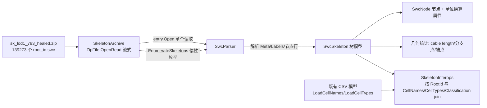

## 需求概述

在 `src/FlywireAI/FlywireAI.vbproj` 项目中新增 FAFB v783 神经元骨架（SWC 格式）解析模块，并用 `F:\flywire\FAFB-v783\sk_lod1_783_healed.zip` 中的真实文件做 demo 测试。

## 核心功能

- **SWC 解析器**：解析 `#` 注释头（含 `# Meta: {...}` JSON 与 `# Labels:` 标签字典）与节点数据行 `n label x y z radius parent`，支持从文件路径、文本、Stream、行序列四种输入解析。
- **骨架树模型**：构建双向父子关系（容忍父节点编号小于/大于子节点编号的前向引用），提供按 label 查询、根节点、分支点、末端点、节点类型直方图、总 cable length 等几何统计。
- **单位处理**：坐标与半径按文件原值以 `Double` 保存，同时记录文件声明的单位（实际为 nanometer），并提供纳米/微米换算访问器（节点级与骨架级）。
- **压缩包封装**：对 139,273 个 `<root_id>.swc` 的 zip 提供按 root_id 读取单个骨架、按条目名读取、以及惰性遍历全部骨架（批量分析用，不一次性解压 13 GB）。
- **与 FAFB 模型联动**：骨架携带精确的 `RootId`（Int64），可与既有 `CellNames`、`CellTypes`、`Classification`、`CellStats` 等模型按 root_id 关联与 join 查询。
- **demo 测试**：使用压缩包内真实骨架文件验证解析正确性、树完整性、单位换算、归档批量枚举性能，以及与 CSV 注释模型的互操作。

## 已确认约束

- 模型深度：树结构 + 与 FAFB 模型联动。
- 压缩包：既要封装单个读取，也要支持批量流式枚举。
- 单位：原样保留 + 记录单位 + 提供换算属性。
- 文档写 “units are in microns”，但文件 Meta 与坐标量级（x 约 1.9e5）实际为 nanometer；两类访问方式都要可用，并在注释中记录该出入。

## 技术栈

- 语言与框架：VB.NET（net10.0），目标工程 `src/FlywireAI/FlywireAI.vbproj`（`RootNamespace = FlywireAI`），命名空间 `FlywireAI.FAFBv783`。
- 复用既有引用（无需新增依赖）：
- `Microsoft.VisualBasic.Core`：`Microsoft.VisualBasic.Serialization.JSON`（`&lt;Extension&gt; LoadJSON(Of T)(json$, ...)`，用于解析 Meta JSON）、`Microsoft.VisualBasic.Linq`、`Microsoft.VisualBasic.Scripting.Runtime`（`IParser` 参考）、`Microsoft.VisualBasic.Text.Encodings`。
- `Microsoft.VisualBasic.Data.Framework`：既有 CSV 模型加载（互操作演示用）。
- `System.IO.Compression`（net10.0 内置）：`ZipFile.OpenRead` / `ZipArchive.Entries` / `ZipArchiveEntry.Open`。
- 工程为 SDK 风格，新增 `**/*.vb` 自动纳入编译，**无需修改 vbproj**。

## 实现方案

**总体策略**：三文件模块化落地——「模型 + 树」`SwcModel.vb`/`SwcSkeleton.vb`、「解析器」`SwcParser.vb`、「归档与互操作」`SkeletonArchive.vb`，全部集中在 `src/FlywireAI/FAFBv783/`，与既有 `FAFBv783Loader.vb`、18 个数据模型保持同一命名空间与文档风格；最后在 `src/test/Program.vb` 追加 demo 段。

**关键决策与理由**：

1. **两遍解析建树**：第一遍解析出 `List(Of SwcNode)` 并用 `Dictionary(Of Integer, SwcNode)` 建立 id 索引，第二遍按 `Parent` 绑定 `ParentNode`/`Children`。原因是实测存在 `parent &gt; id` 的前向引用（如节点 2 的 parent=10），单遍按顺序建树会失败；两遍为 O(n)，对最大 20 MB / 约 40 万节点文件仍在亚秒级。
2. **单位显式建模**：解析 `# Meta` 的 `"units": "1 nanometer"` 为 `SwcUnits` 枚举（同时兼容 micrometer/micron/µm 等写法），`SwcNode` 保留原值 `X/Y/Z/Radius` 并携带单位，额外提供 `XNm/XMicrons` 等换算属性；骨架级提供 `CableLengthNano`/`CableLengthMicrons`。这样既满足「原样保留」，也满足文档所述 microns 场景。
3. **归档全流式**：`ZipFile.OpenRead`（`FileShare.Read`，中央目录约 14 MB，开销可忽略）→ 按条目名/root_id 定位 → `entry.Open()` 交给解析器。`EnumerateSkeletons()` 为惰性 `Iterator`，逐个骨架 yield，内存 O(1)，绝不做全量解压（13 GB）。
4. **互操作不改既有模型**：不给 18 个模型类加接口，改用泛型 join 助手（`ToRootIdIndex(Of T)(source, rootId As Func(Of T, Long))` + `JoinSkeleton`）+ 少量 `GetSkeleton(archive, cell)` 重载，避免改动已完成并已通过测试的代码（降低回归风险）。
5. **容错优先**：跳过空行与非法行并累计计数，父节点缺失/重复 id 记为 `Warnings` 而非抛异常，保证 139,273 个异构文件批量枚举不会中途中断。

**性能与可靠性**：

- 解析使用 `StreamReader` 逐行 `ReadLine`（不使用 `ReadAllLines`），避免 20 MB 文件的双份驻留；建树用字典查找 O(n)。
- 批量枚举 demo 仅取前若干个骨架并统计，避免 13 GB 压缩包全量解压；单文件最大 20 MB 单独计时以验证吞吐。
- 所有 `ZipArchive`/`StreamReader`/`Stream` 均以 `Using` 释放；`SkeletonArchive` 实现 `IDisposable`。
- demo 断言以「文件自身可验证的事实」为主（条目名 == Meta.id、根节点唯一、非根节点父节点存在、label 与 children 结构一致、单位换算往返一致），少用魔法数字，规避数据持续更新带来的脆弱断言。

## 架构设计



## 目录结构

```
src/FlywireAI/FAFBv783/
├── SwcModel.vb            # [NEW] SWC 基础类型：SwcUnits 单位枚举与换算、SwcMeta（id/name/units，由 Meta JSON 反序列化）、SwcLabel（label 值与原义）、SwcNode（Id/Label/X/Y/Z/Radius/Parent/ParentNode/Children + XNm/XMicrons 等换算属性 + ToString）
├── SwcSkeleton.vb         # [NEW] 骨架树模型：RootId、Meta、Labels 字典、Nodes、按 id 索引、Roots、GetNode、按 label 查询（GetNodesByLabel/SomaNodes/ForkPoints/EndPoints）、NodeTypes 直方图、Children 一致性校验、CableLength(nm/µm)、坐标包围盒、ToString 摘要
├── SwcParser.vb           # [NEW] 解析器：ParseFile(path, encoding)、ParseText(text)、Parse(stream)、ParseLines(IEnumerable(Of String))；头部注释解析（Meta JSON 用 LoadJSON(Of SwcMeta)，Labels 段用 “值 = 名称” 规则）、数据行按空白分词并 Double 解析、两遍建树、容错与 Warnings 收集、RootId 由 Meta.id 或条目名精确解析为 Long
├── SkeletonArchive.vb     # [NEW] zip 归档封装（IDisposable）：Open(path)、EntryCount、EntryNames、Contains(rootId/entryName)、ReadSkeleton(rootId/entryName)、EnumerateSkeletons() 惰性枚举、以及 GetSkeleton 互操作重载（CellNames/CellTypes/Classification/CellStats）
├── SkeletonInterops.vb    # [NEW] 互操作助手模块：ToRootIdIndex(Of T)(source, rootId 选择器)、JoinSkeleton(Of T)(cells, rootId 选择器, skeletons 索引)、SkeletonFileNames(rootIds)，全部为泛型/扩展方法，不改动既有 18 个模型类
└── FAFBv783Loader.vb      # [不变] 既有 CSV 加载模块，本次不改动
src/test/
└── Program.vb             # [MODIFY] 追加 demo 段：SWC 解析与归档枚举、与 CSV 注释模型按 root_id 互操作；沿用既有 check()/run()/csv() 辅助函数与 pass/fail 汇总风格
```

## 关键代码结构

```
' SwcModel.vb —— 节点记录与单位
Public Enum SwcUnits
    Unknown
    Nanometer
    Micrometer
End Enum

Public Class SwcNode
    Public Property Id As Integer
    Public Property Label As Integer
    Public Property X As Double
    Public Property Y As Double
    Public Property Z As Double
    Public Property Radius As Double
    Public Property Parent As Integer          ' -1 表示根节点
    Public Property Unit As SwcUnits           ' 由文件的 Meta 段写入

    Public Property XNm As Double              ' 换算访问器
    Public Property XMicrons As Double
    Public ReadOnly Property ParentNode As SwcNode
    Public ReadOnly Property Children As List(Of SwcNode)
End Class

' SwcParser.vb —— 解析入口（全部为无状态共享方法）
Public Module SwcParser
    Function ParseFile(path As String, Optional encoding As Encoding = Nothing) As SwcSkeleton
    Function ParseText(text As String) As SwcSkeleton
    Function Parse(stream As Stream, Optional entryName As String = Nothing) As SwcSkeleton
    Function ParseLines(lines As IEnumerable(Of String), Optional entryName As String = Nothing) As SwcSkeleton
End Module

' SkeletonArchive.vb —— 归档封装
Public Class SkeletonArchive : Implements IDisposable
    Shared Function Open(path As String) As SkeletonArchive
    ReadOnly Property EntryCount As Integer
    Function Contains(rootId As Long) As Boolean
    Function ReadSkeleton(rootId As Long) As SwcSkeleton
    Function ReadSkeleton(entryName As String) As SwcSkeleton
    Iterator Function EnumerateSkeletons() As IEnumerable(Of SwcSkeleton)
End Class
```

## 验证方式

1. 编译：`dotnet build .\flywire.slnx -c Debug -p:Platform=x64`，要求 0 warning / 0 error。
2. 运行 demo（真实数据 `F:\flywire\FAFB-v783\sk_lod1_783_healed.zip`），逐项断言并汇总 pass/fail：

- 归档：条目数大于 0、`Contains` 命中指定 root_id、条目名与 Meta.id 一致。
- 解析最小条目 `720575940590515268.swc`：单位解析为 Nanometer、节点数大于 0、根节点唯一且 label 为 soma(1)、所有非根节点父节点存在、无自环、label 与 children 结构一致。
- 单位换算：`XMicrons * 1000` 与 `X` 一致（容差比较），并打印坐标量级以佐证实际为纳米。
- 几何统计：cable length（nm 与 µm）非 0、分支点/末端点计数合理。
- 批量流式枚举：惰性取前 5 个骨架，root_id 唯一且均可解析，打印耗时与节点总数；额外对最大条目（约 20 MB）计时验证吞吐。
- 互操作：加载 `names.csv`、`consolidated_cell_types.csv` 建 root_id 索引，与归档骨架 join 成功并打印「name + cell type + 节点数 + cable length」。