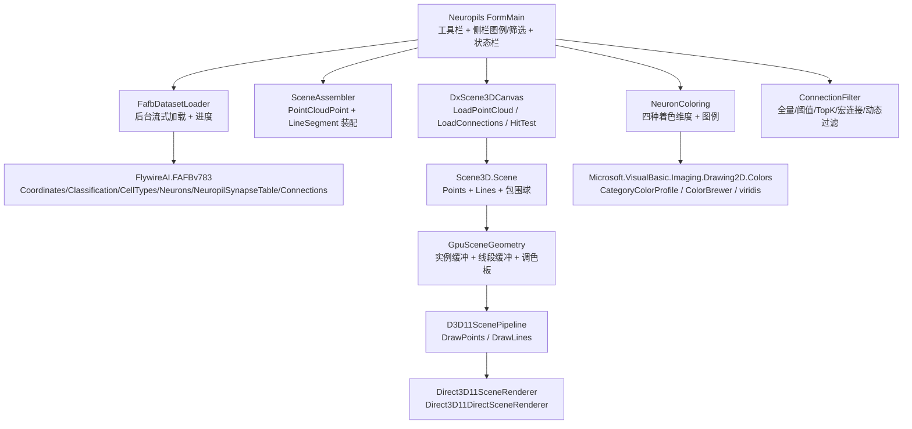

## 产品概述
在 `src\Neuropils\Neuropils.vbproj`（空白 WinForm）中构建一个**果蝇全脑三维可视化程序**：加载 FAFB v783 真实数据，把 139,255 个神经元渲染为**三维点云**，把 534 万条突触连接渲染为**三维连线**，并按脑区/细胞类型/神经递质/仿真活跃度用不同颜色区分，支持筛选、拾取查询与截图。渲染基于工作区已引用的 DirectX 组件（`DXApi` + `DxCanvas`）。

## 核心功能

- **三维点云**：按 `coordinates.csv` 的神经元坐标生成 13 万个彩色点，可调点大小、可切换点云/线框/面渲染模式。
- **三维连接线**：为 `DXApi\Scene3D` 新增「位置 + 逐顶点颜色」的线段通道（线段集合 + 顶点缓冲 + HLSL + 输入布局 + 绘制调用 + 两个后端的绘制序列），使百万级连线可与点云同帧渲染且同档性能。
- **四种着色维度（可切换）**：① 主导脑区（由 321 列脑区突触计数取最大项，约 80 个脑区各一色）② 神经递质类型（GABA/ACH/GLUT/DA/SER/OCT 等）③ 细胞类型/分类层级（`primary_type`、`super_class`/`class`）④ 仿真活跃度（逐神经元脉冲计数热力图）。
- **四种连接规模控制**：全量 534 万条；按突触强度阈值/Top-K 筛选（界面可调）；聚合为「脑区↔脑区」宏连接（粗线表示强度）；按选中脑区/细胞类型动态过滤。
- **交互与输出**：轨道相机（旋转/平移/缩放/FitView）、点击神经元查询详情（root_id、脑区、细胞类型、递质、坐标、连接数）、侧栏颜色图例与勾选显隐、后台线程加载与进度显示（避免界面冻结）、截图导出。

## 视觉与交互效果
深色科学可视化风格：深灰蓝背景上高饱和分类色点云与半透明连线，左侧为图例/筛选侧栏，右侧为全屏三维画布，顶部工具栏切换着色维度与连接规模，底部状态栏显示设备/帧率/选中信息；鼠标悬停高亮、点击弹出详情、拖动流畅旋转。


## 技术栈
- 语言/框架：VB.NET（`net10.0-windows`）+ WinForms；GPU 渲染用工作区已有 `DXApi`/`DxCanvas`（D3D11 + 运行时编译 HLSL），数据加载用已有 `FlywireAI.FAFBv783` 加载器
- 配色直接复用已有库：`Microsoft.VisualBasic.Imaging.Drawing2D.Colors`（`CategoryColorProfile` / `Designer.GetColors` / `ColorBrewer` 定性色板）
- 数据：`F:\flywire\FAFB-v783\`（`coordinates.csv` 13.9 MB、`connections_princeton.csv` 261 MB、`neuropil_synapse_table.csv` 85.8 MB、`consolidated_cell_types.csv`、`classification.csv`、`neurons.csv`、`names.csv`）

## 实现方案

### 总体策略
分三层推进：**先给外部库补上缺失的线段渲染能力（纯新增、不改变既有行为）→ 再在控件层暴露连接线入口与拾取能力 → 最后在 Neuropils 里做数据装配、配色、筛选与交互**。点云复用现成的「单位 quad × 实例化」（`DrawInstanced(6, N)`），连线新增「LINELIST + 逐顶点颜色」，两者都是**一次性上传不可变缓冲、每帧仅更新常量缓冲**，因此 13 万点 + 千万级线段仍在同一帧内完成。

### 关键决策与理由
1. **必须扩展 DXApi 才能画任意线段**：现有 `Scene3D` 只有点云（实例化 quad）与三角面两条通道，唯一用线的地方是地面网格（位置-only + 单一常量色 + 固定 1 像素），**没有公开线段 API**。因此新增 `LineVertex(X,Y,Z,R,G,B,A)`（stride 16）、`Scene3DInputLayout.LineElements/LineStride`、HLSL `VS_Line`/`PS_LineColor`、`D3D11ScenePipeline.DrawLines`，并在**两个** D3D11 后端的绘制序列末尾插入调用。改动为纯新增，`ModelViewer` 与既有绘制路径不受影响（且全仓无 Scene3D 渲染断言测试）。
2. **线段与点云共存语义**：`LoadPointCloud`/`LoadSurfaces` 现有实现会互相清空，若线段也被清空则无法叠加。故新增独立 `LoadLineSegments(...)`，并让 `HasData` 纳入线段、`Clear()` 复位线段；**同时把取景包围球改为「点云 ∪ 线段端点」统一重算**，否则 `FitView` 会把连线端点裁出屏幕。
3. **连接规模必须可控**：534 万条线段 = 1068 万顶点 × 16 B ≈ 171 MB 顶点缓冲，可一次性上传；但视觉上会糊成一团，因此把「全量 / 强度阈值 / Top-K / 脑区宏连接聚合 / 脑区动态过滤」全部做成运行时可切换（切换时重建线段集合并让 `Scene` 版本号自增，触发 GPU 几何体自动重建，无需改缓存机制）。
4. **活跃度的数据来源要修正**：现有 `snn-output` 只有 Top-50/5000 刺激/聚合结果，**没有全量逐神经元计数**。因此提供两条路径：① 现场运行仿真（`BrainSimulationResult.Counts` 长度即 N=139,255，GPU 全脑 T=30 实测约 4 ms）；② 加载全量计数 csv，并顺带在 `SimulationReport` 增加一个全量计数 writer，使后续结果真正可复用。
5. **加载必须后台化 + 流式**：261 MB 连接表与 321 列脑区表走 `FAFBv783Loader.Stream*`（O(1) 内存、逐行回调）在后台线程读取并汇报进度，UI 线程只负责最后把数组交给控件；避免全量 `LoadCsv` 造成内存峰值与界面冻结。
6. **拾取用 CPU 投影**：`SceneTransform` 的矩阵是 GPU 行向量约定，不能直接用于 CPU 投影；改用与两个后端绘制一致的 `Camera.Rotate` + `Camera.Project`，先剔除相机后方（`depth <= 0`）的点再按像素半径取最近命中。
7. **不引入新技术债**：着色、配色、数据模型、加载器全部复用既有实现（`CategoryColorProfile`、`FAFBv783Loader`、`PointCloudPoint`），仅在必要处新增薄封装层。

## 架构设计



### 模块划分
- **DXApi 扩展层**：线段数据结构与 GPU 通道（`LineSegment`、`Scene.LoadLineSegments`、`LineVertex`、`DrawLines`、HLSL）。
- **控件层**：`DxScene3DCanvas` 新增 `LoadConnections`/`LineCount`/`ShowConnections`/`HitTest`。
- **数据层（Neuropils）**：`FafbDatasetLoader`（加载+解析+聚合）、`BrainSceneData`（内存模型）。
- **表现层**：`NeuronColoring`（配色与图例）、`SceneAssembler`（场景装配）、`FilterPanel`/`LegendPanel`、`NeuronInspector`。

## 目录结构

```
G:/Microsoft.VisualBasic.Drawing/src/DXApi/Scene3D/
├── LineSegment.vb              # [NEW] 线段结构：两端点(Point3D) + 颜色；提供长度与端点枚举
├── Scene.vb                    # [MODIFY] 新增 m_lines/Lines/LineCount/LoadLineSegments；Clear 复位；HasData 纳入线段；
│                               #          取景 centre/radius 与 LowestZ 改为「点云 ∪ 线段端点」统一重算；版本号自增
├── GpuSceneGeometry.vb         # [MODIFY] 新增 LineVertex 结构(stride 16)、m_lineBuffer/LineVertexCount、BuildLines、
│                               #          构造器调用、Dispose 释放
├── Scene3DShaders.hlsl         # [MODIFY] 新增 VS_Line / PS_LineColor（位置 + 顶点色，直接输出颜色）
├── Scene3DShaders.vb           # [MODIFY] 新增 EntryLineVertex/EntryLinePixel 常量 + LineElements/LineStride = 16
├── D3D11ScenePipeline.vb       # [MODIFY] 新增 m_lineLayout/m_lineVertex/m_linePixel（编译+创建+Dispose）与 DrawLines
│                               #          （照抄 DrawGround 的 LINELIST 写法，改用 m_depthWrite 正确遮挡）
├── Direct3D11SceneRenderer.vb  # [MODIFY] DrawScene 末尾追加 DrawLines（点云/面/线框之后叠加）
├── Direct3D11DirectSceneRenderer.vb  # [MODIFY] 同上（直连 back buffer 后端）
└── SceneRenderOptions.vb       # [MODIFY] 新增 ShowConnections/ConnectionAlpha 等选项，并同步 Clone() 与
                                #          GeometrySignature()（否则改选项不触发几何体重建）

G:/Microsoft.VisualBasic.Drawing/src/DxCanvas/
└── DxScene3DCanvas.vb          # [MODIFY] 新增 LoadConnections(lines)、LineCount、ShowConnections 属性（含快捷键）、
                                #          HitTest(x, y) 返回最近命中的神经元索引/线段信息（CPU 投影，剔除相机后方）

G:/flywire/src/Neuropils/
├── FormMain.vb                 # [MODIFY] 装配顺序：注册 GPU 渲染器 → 后台加载数据 → 装配场景 → 着色 → 状态栏
├── FormMain.Designer.vb        # [MODIFY] 三维画布(Dock=Fill) + 顶部工具栏 + 左侧侧栏 + 底部状态栏
├── BrainSceneData.vb           # [NEW] 内存模型：NeuronRecord(坐标/脑区/递质/细胞类型/名称/连接数) + 连接数组 + 索引；
│                               #        提供按 root_id 查询与分组统计
├── FafbDatasetLoader.vb        # [NEW] 后台流式加载：position 字符串 "[x y z]" 解析、321 列脑区反射取 argmax、
│                               #        递质/细胞类型/分类映射、连接筛选与脑区聚合、进度与取消；
│                               #        全量逐神经元计数 csv 的读取（供活跃度着色）
├── NeuronColoring.vb           # [NEW] 四种着色维度 → 每神经元颜色（CategoryColorProfile/ColorBrewer/viridis）+ 图例项生成
├── SceneAssembler.vb           # [NEW] 生成 PointCloudPoint() 与 LineSegment()，把颜色/筛选结果映射进场景
├── ConnectionFilter.vb         # [NEW] 全量/强度阈值/Top-K/脑区宏连接聚合/按脑区与细胞类型动态过滤
├── FilterPanel.vb              # [NEW] 侧栏：着色维度切换、脑区/类型/递质勾选、连接阈值与规模选择、统计计数
└── NeuronInspector.vb          # [NEW] 拾取结果面板：显示 root_id/坐标/脑区/类型/递质/连接数与高亮定位

G:/flywire/src/FlywireAI/Connectome/
└── SimulationReport.vb         # [MODIFY] 新增「全量逐神经元脉冲计数」writer（列：neuron_index,root_id,spike_count,
                                #          firing_rate），使活跃度着色可复用历史结果
```

## 关键代码结构

```vb
' 线段数据结构（DXApi\Scene3D\LineSegment.vb）
Public Structure LineSegment
    Sub New(a As Point3D, b As Point3D, Optional color As Color = Nothing, Optional tag As Integer = -1)
    Public Property A As Point3D
    Public Property B As Point3D
    Public Property Color As Color         ' 逐线段颜色（写进两个端点的顶点色）
    Public Property Tag As Integer         ' 业务索引：指向连接/神经元，用于拾取与筛选
End Structure

' 控件层新增入口（DxCanvas\DxScene3DCanvas.vb）
Public Sub LoadConnections(lines As IEnumerable(Of LineSegment))
Public ReadOnly Property LineCount As Integer
Public Property ShowConnections As Boolean          ' 与 ShowGround 对称，需同步 SceneRenderOptions
Public Function HitTest(x As Integer, y As Integer, Optional radius As Integer = 8) As NeuronHit
```

## 实施要点（执行细节）

- **顶点格式与布局必须严格对应**：`LineVertex` 为 `X,Y,Z As Single` + `R,G,B,A As Byte`（stride 16），`LineElements` 的 `COLOR` 用 `DXGI_FORMAT.R8G8B8A8_UNORM @ offset 12`；任一不一致会导致顶点错位。
- **矩阵不要转置**：HLSL 用 `mul(worldViewProj, float4(pos,1))`（行向量约定），照抄 `VS_Position` 即可。
- **版本号是几何体重建的唯一触发点**：`Scene.LoadLineSegments` 必须 `m_version += 1`；`SceneRenderOptions` 新增选项必须同步 `GeometrySignature()` 与 `Clone()`。
- **绘制顺序**：连线放在点云/面之后（叠加层）；连线使用 `m_depthWrite` 以便与几何正确遮挡。
- **点云逐点颜色必须同时设 `UseEmbeddedColor = True`**（且 alpha 不能为 0，否则会被当作"无颜色"哨兵走热力图分支）。
- **性能与内存**：连接顶点缓冲一次性上传（171 MB @ 全量）；加载走 `Stream*` 流式；切档位时重建线段集合再 `RequestRender()`，不要每帧重建。
- **稳定性**：后台加载异常需回传 UI（状态栏 + 消息框），取消操作要能中断流式枚举；`DxScene3DCanvas` 无内部定时器，动画/重绘一律 `RequestRender()`。
- **不做（本期）**：7 GB 突触级坐标、13 GB SWC 骨架、粗线/透明线（1 像素线宽为既有光栅化器约定）。

## 验证方式

1. **编译回归**：`DXApi`、`DxCanvas`、`ModelViewer`、`Neuropils` 四个工程全部编译通过（DXApi 改动不得破坏 ModelViewer）。
2. **数据正确性**：加载后断言神经元点数 = 139,255（`names.csv` 全量 root_id）、坐标解析正确（`position` 逐字解析为三个纳米值）、脑区 argmax 结果落在 80 个脑区名集合内、连接条目数与 csv 行数一致。
3. **渲染与性能**：记录并报告 ① 载入耗时（坐标 / 分类 / 脑区 / 连接各阶段）② 13 万点 + 全量连线的帧率与显存占用 ③ 各连接档位切换后的重建耗时。
4. **功能验收**：四种着色维度切换生效且图例与颜色一致；强度阈值/Top-K/宏连接/脑区显隐四种规模控制可用；点击任一点能弹出正确的 root_id 与注释信息；截图可导出。
5. **健壮性**：数据目录缺失/文件损坏时给出明确错误而非崩溃；加载中取消可正常回到空场景。


## 设计定位
面向科研的深色系三维数据探索界面（Scientific Dark），左侧控制面板 + 右侧全屏三维视口的经典桌面布局，强调"数据即视觉中心"：画布占据绝大部分面积，控件低调不抢戏，配色高饱和以在深色背景上区分 80+ 类脑区。

## 界面结构（自顶向下）
- **顶部工具栏**（高 40 px，深色渐变底）：着色维度下拉（主导脑区/神经递质/细胞类型/仿真活跃度）、连接规模下拉（全量/阈值/Top-K/脑区宏连接）、点大小滑块、渲染模式切换（点云/线框/面）、FitView 与截图按钮；右侧显示当前设备与后端。
- **左侧侧栏**（宽 300 px，可折叠）：上部为颜色图例（色块 + 类别名 + 数量，可搜索/全选/反选、勾选即显隐）；中部为连接控制（强度阈值滑块、Top-K 输入、宏连接开关、透明度滑块）；下部为统计摘要（神经元总数/当前显示数/连接数/活跃占比）。
- **右侧三维画布**（Dock=Fill）：深灰蓝背景 + 淡地面网格，点云与连线渲染；右下角浮动显示帧率、点数、线数与提示（"左键旋转 / 右键平移 / 滚轮缩放 / 点击查询"）。
- **底部状态栏**（高 24 px）：加载进度条（后台加载时可见，含阶段文本与取消按钮）、当前选中神经元摘要、悬停提示。

## 视觉与交互细节
- **配色**：背景 `#0B1015` 到 `#121A22` 的径向渐变；面板 `#151D26` 配 1 px `#243040` 描边与 8 px 圆角；选中类别高亮描边 `#22D3EE`。
- **点与线**：点用正方形 quad，默认 2 px，按类别着色；连线默认 1 px、alpha 约 120，按连接强度或来源脑区着色，宏连接模式下用更亮的同类色。
- **微交互**：鼠标悬停时在最近点周围绘制圆形高亮环并显示浮层提示（root_id + 名称）；点击后侧栏下部与详情面板同步更新并高亮该神经元及其连接；着色维度切换时以 150 ms 淡入过渡（通过定时器少量帧插值 alpha 实现）。
- **响应式**：窗口缩放时画布自适应，侧栏可折叠为 40 px 图标条；控件按 96 DPI 像素坐标绘制（与 DirectX 画布一致），高 DPI 下不额外缩放以保证鼠标拾取与渲染坐标同源。

## 字体与文案
- 全局思源黑体，标题 15 px/600，正文 12.5 px/400，数字与 root_id 使用等宽风格显示便于比对；图例类别名超长时省略号截断并提供悬停全名。

## Agent Extensions
### SubAgent
- **code-explorer**
  - Purpose: 在实施阶段精确复核 DXApi 扩展点的内部细节（避免破坏既有渲染），包括 `Scene.vb` 包围球计算与 `LowestZ` 的调用关系、`GpuSceneGeometry` 构造器与 `Dispose` 的完整资源清单、`D3D11ScenePipeline` 的着色器/输入布局创建与释放点、`GeometryOf` 的缓存签名机制、以及 `Direct2DSceneRenderer` 回退路径是否需要同步处理线段；同时复核 `FlywireAI` 侧 `NeuropilSynapseTable` 的列名反射规律与 `FAFBv783Loader.Stream*` 的逐行回调签名。
  - Expected outcome: 获得逐字签名与最小可用调用片段（含字段顺序、stride 偏移、Dispose 顺序），据此一次性写出可编译的线段通道与数据加载器，把编译-报错试错轮次降到最低。
