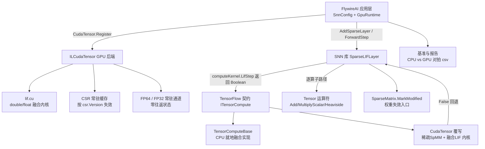

## 产品概述

对 SNN 脉冲神经网络库（`SNN.vbproj`）做性能改造，使其通过 TensorFlow 的可插拔张量后端（`Tensor.computeKernel`）充分调用 `ILCudaTensor.vbproj` 的 GPU（本机 NVIDIA RTX A4000 / sm_86），从而在**可接受的精度与时间内运行完整的果蝇全脑仿真**（139,255 神经元 / 3,732,460 条合并突触 / T=30）。

## 核心功能

- **融合 LIF 单步算子**：把「稀疏递归输入 + 泄漏积分 + 阈值触发 + 复位 + 脉冲计数累加」合并为**两次内核启动、零主机往返**的一次调用（现状为每步 6 个张量分配 + 6~12 次显存往返）。
- **设备常驻**：`H` / `Sprev` / `counts` 三个状态张量在 T 步之内始终驻留显存，跨步复用缓冲，仅在仿真结束时回读。
- **双精度保真**：设备常驻在原有 FP32 通道之外**新增 FP64 通道**，使「零往返」与「CPU/GPU 对拍 max|Δ| ≤ 1e-9」两个目标同时成立。
- **兼容回退链**：GPU 融合（FP64 常驻）→ GPU 融合（FP32 常驻）→ GPU 逐算子 → CPU 逐算子，后端不支持时自动降级，既有行为与既有测试不受影响。
- **正确性修复**：为 `SparseMatrix` 增加公开的权重失效入口，避免 GPU 侧 CSR 缓存静默复用旧权重（影响增益标定）。
- **主机侧热点消除**：`Network.ForwardSparse` 的 O(T·N) 主机累加、`Decoder` 的 O(T·N) 统计循环、`Encoder` 每步克隆、`SHistory` 历史缓存（可关闭）。
- **应用层 GPU 注册与基准**：FlywireAI 侧注册 GPU、暴露配置开关，并产出「CPU vs GPU 全脑对拍 + 加速比 + 落盘 csv」的基准报告。

## 已确认约束

- 优化深度：**融合算子 + 设备常驻**（最大改动档）。
- 依赖方向：**应用层注册**（FlywireAI 调用 `CudaTensor.Register`，SNN 库保持无 CUDA 依赖，分层仍为 CUDA → TensorFlow）。
- 验收：全脑 CPU/GPU **对拍 max|Δ| ≤ 1e-9**，且 **GPU 显著快于 CPU**，结果写入 demo 与 csv 基准报告。
- 改动约束：允许重构 SNN 内部（`ForwardStep` / 解码路径），但必须保留兼容回退路径；不得破坏现有回归（`flywire.slnx` 编译 0 warning / 0 error、demo 第 1~9 段当前 106/106 通过、`SNN/test` 既有 demo 通过）。

## 技术栈

- 语言/框架：VB.NET（net10.0）；三个待改工程与一个应用工程
- `G:\GCModeller\src\runtime\sciBASIC#\Data_science\MachineLearning\TensorFlow\TensorFlow.vbproj`（后端契约与 CPU/SIMD 实现）
- `G:\GCModeller\src\runtime\sciBASIC#\cuda\ILCudaTensor\ILCudaTensor.vbproj`（GPU 实现：新内核、常驻、融合覆写）
- `G:\GCModeller\src\runtime\sciBASIC#\Data_science\MachineLearning\SNN\SNN.vbproj`（被优化对象）
- `G:\flywire\src\FlywireAI\FlywireAI.vbproj`（应用层：GPU 注册、配置、基准与报告）
- GPU 运行时：CUDA Driver API（`nvcuda.dll`）+ NVRTC（`C:\Program Files\NVIDIA GPU Computing Toolkit\CUDA\v13.3\bin\x64\nvrtc64_130_0.dll`，`NvrtcCompiler.FindCandidates` 会命中该固定路径），无需新增第三方依赖

## 实现方案

### 总体策略

以「一次调用完成一整步 LIF」为目标，把计算从「主机编排 + 逐算子往返」改为「设备内两段内核 + 状态常驻」：

1. **契约层扩展（加法式）**：在 `ITensorCompute` 新增 `LifStep(...) As Boolean`（返回 `False` 表示不支持，调用方回退）；在 `TensorComputeBase` 给出 CPU 就地实现（消除中间张量分配）；`CudaTensor` 覆写为 GPU 融合实现。
2. **CUDA 侧**：新增 1 个内核文件 `Kernels\lif.cu`（含 **double 与 float 两个**逐元素融合内核，命名加 `TLF_` 前缀避免与同编译单元其它 `.cu` 冲突）；SpMM 复用既有 `tensorSpmmCsrKernel`，但输出写入**持久** `I` 缓冲而非临时分配。
3. **常驻扩容**：在 `DeviceResidentStore` 之外新增 **FP64 常驻通道**（例如 `DeviceResidentStore64`），并在 `PinDevice/UnpinDevice/IsDevicePinned/SyncFromDevice` 中做成「双通道」语义（FP32 通道保持原样以兼容 `TryAdamWStep`），使融合算子可走「FP64 常驻 = 零往返 + 双精度」。
4. **SNN 侧**：`SparseLIFLayer` 增加持久缓冲（`H/Sprev/I/S/counts`，仅分配一次）+ 「融合优先、逐算子回退」的 `ForwardStep`；`Network` / `Decoder` / `Encoder` 去除主机 O(T·N) 循环与每步克隆；`SHistory/UHistory` 改为可开关。
5. **应用层**：FlywireAI 增加 `ILCudaTensor` 工程引用与 GPU 配置（设备号、NVRTC 路径、缓存字节、精度档位、阈值），在装配网络前注册、结束后注销；`SetGain`/`ApplyGain` 就地改权重后必须调用新的 `SparseMatrix.MarkModified()` 使 CSR 缓存失效。
6. **基准与对拍**：同一连接组、同一刺激方案、同一种子，分别以 CPU / GPU(P1 FP64 常驻) / GPU(P2 FP32 常驻) 跑 T=30，逐神经元脉冲计数对拍并统计 max|Δ|、差异神经元数与占比、逐步耗时与吞吐，落盘 csv。

### 关键决策与理由

1. **契约用「返回 Boolean」而非新异常**：沿用 `TryAdamWStep` 的既有范式（`CudaTensor.vb:1401-1438`），不支持即 `False`，让 SNN 层无需引用 CUDA 类型即可回退，完美满足「应用层注册 + 库保持无 CUDA 依赖」。
2. **常驻必须扩到 FP64，而非接受 FP32 精度损失**：`DeviceResidentStore` 仅存 `DeviceBuffer(Of Single)`，而验收要求 `max|Δ| ≤ 1e-9`。若只用 FP32 常驻，SpMM 的 `atomicAdd` 非确定性叠加 FP32 舍入，会在阈值附近翻转个别神经元，无法满足硬门槛。故显式新增 FP64 通道：**P1（FP64 常驻）= 精度受控档（断言 1e-9）**，**P2（FP32 常驻）= 最快档（报告实测偏差）**。
3. **一个 `.cu` 内同时放 double/float 两个融合内核**：新增内核只需改 4 处（`.cu` 文件、`vbproj` 的 `EmbeddedResource`、`TensorKernelNames` 常量、`CudaTensor` 调用点）；`KernelNames.vb`/`KernelCatalog` 是框架自带内核表，业务内核按约定放在 `ILCudaTensor` 自己的 `TensorKernelNames`。
4. **SpMM 不重写，只改输出去向**：`spmm.cu` 已是被验证过的实现（行并行 + 稀疏零源跳过 + `atomicAdd`），融合算子内部直接 `_csrCache.GetBuffers` 取常驻 CSR、启动同一内核写入持久 `dI`，避免重复实现与新增风险。
5. **状态张量在 SNN 层分配、由后端常驻**：SNN 只调用契约成员 `PinDevice/IsDevicePinned/SyncFromDevice`（参数均为 `Tensor`，不引入 CUDA 类型依赖），常驻细节封装在 `CudaTensor` 内。
6. **可开关的历史与统计**：全脑 T=30 时 `SHistory` 会保留 30 个 `[1,N]` 张量（约 33 MB FP64 / 17 MB FP32），并伴随每步回读；默认在「性能模式」下关闭历史，仅保留逐步统计（由融合内核内的原子累加在设备侧产出）。
7. **正确性优先于跑通**：新增 `SparseMatrix.MarkModified()` 公开入口，凡就地改 `Values`（`SetGain`/`ApplyGain`/`Normalize` 之外的路径）后必须失效；否则 GPU 会静默使用旧权重，产生「CPU 与 GPU 结果不同且无法定位」的伪 bug。

### 性能与可靠性

- **复杂度**：SpMM 仍为 `O(nnz)`/步（nnz=3,732,460），逐元素为 `O(N)`/步（N=139,255）；融合后每步仅 2 次内核启动、0~1 次小回读，主机侧无 O(N) 循环。
- **显存预算**：CSR 常驻 `nnz×(4+4+8) ≈ 60 MB`；FP64 状态常驻 `H+Sprev+counts+I ≈ 4×139,255×8 ≈ 4.5 MB`；FP32 镜像约 2.2 MB；`SHistory`（若开启）T=30 约 33 MB。总计远低于 16 GB。
- **瓶颈与缓解**：唯一剩余往返是「每步/终局的状态回读」；P1 定为终局回读一次（性能模式），若要逐步统计则由设备侧原子累加产出 2 个标量，避免 1.1 MB/步的传输。
- **可靠性**：`LifStep` 实现内做形状/长度一致性校验与 `EnsureDeviceCount`（元素数上限 2^31）检查；内核返回 `False`/异常统一降级到 CPU 逐算子路径；GPU 注册失败（`CudaTensor.Register` 返回 `False`）时打印 `LastError` 与 `opts.Diagnostics` 并自动以 CPU 运行。
- **确定性**：SpMM 的 `atomicAdd` 浮点累加顺序不保证确定，因此 demo 的断言基于「与 CPU 参考的 max|Δ|」而非「两次 GPU 运行逐位相同」；P1 的 1e-9 门槛按相对/绝对混合判据（计数为整数和，对拍时以 `max|Δ|` 直接比较，容差 1e-9 等价于要求完全一致）。

## 实施要点（执行细节）

- **新契约成员（唯一签名，务必逐字一致）**：

```
Function LifStep(synapses As SparseCsr,
                 sPrev As Tensor,
                 externalCurrent As Tensor,
                 h As Tensor,
                 s As Tensor,
                 counts As Tensor,
                 beta As Double,
                 threshold As Double,
                 subtractThreshold As Boolean) As Boolean
```

语义：原地更新 `h`（新膜电位）、`s`（本步脉冲 0/1）、`counts`（累加脉冲计数，需调用方预先清零）；`sPrev` 与 `externalCurrent` 只读；`externalCurrent` 允许为 `Nothing`（表示无外部注入）；不支持时返回 `False`。

- **CUDA 覆写实现顺序**（在 `CudaTensor` 内）：`_csrCache.GetBuffers(_engine, synapses)` → 若常驻通道有效则取持久 `dI/dH/dS/dCounts`（`DeviceD64/DeviceF32`），否则按需复用 LRU → 启动 `tensorSpmmCsrKernel`（写入 `dI`，启动前 `Fill(0)`）→ 启动新的 `tensorLifUpdateKernel`（读 `dI/dSprev`，原地写 `dH/dS/dCounts`）→ 需要主机数据时再 `Read/Download`。
- **陷阱清单（必须遵守）**：
- 融合内核**不得**套用 `MinGpuElements`（默认 4096）门槛，否则小网络测试会被静默落 CPU。
- `Device()`（FP64 LRU）**不查**常驻表；任何 pin 过的张量若被 `Device()`/CPU 兜底读取，会从陈旧主机副本重传 → 融合算子内只能用常驻感知的取缓冲路径。
- 主机侧读 `h/s/counts` 之前必须 `SyncFromDevice`（或读设备缓冲），否则 `Data` 陈旧。
- 就地写主机数组后必须 `MarkHostModified()`；就地改 CSR `Values` 后必须 `SparseMatrix.MarkModified()`。
- 所有 `.cu` 会拼进同一 NVRTC 编译单元，内核与宏名必须加前缀（参考 `train.cu` 的 `TAW_`/`TCE_`）。
- `atomicAdd(double)` 需 sm_60+（本机 sm_86 满足）。
- `DeviceBuffer` 计数为 `Int32`，单算子元素数上限 2^31。
- **回退与观察**：`SparseLIFLayer` 记录当前生效路径（`Fused` / `OpByOp` / `Cpu`）供报告与断言读取；`SnnConfig` 增加 `UseGpu`、`GpuDeviceOrdinal`、`GpuNvrtcPath`、`GpuCacheBytes`、`PrecisionMode`（`DoubleResident`/`FloatResident`）、`KeepHistory`、`MinSparseNnz` 等开关。
- **日志与报告**：注册成功打印设备信息（名称/显存/CC）与所选 NVRTC；基准打印 CPU/GPU 各阶段耗时、加速比、max|Δ|、差异神经元数；结果写入 `simulation_summary_*.csv` 与新增的 `gpu_benchmark.csv`。
- **改动范围控制**：所有改动为「新增优先」；既有 CPU 路径、既有阈值默认值、既有公开语义保持不变；不改 `SNN.vbproj` 的引用列表（不引入 CUDA 依赖）。

## 架构设计



## 目录结构

```
G:/GCModeller/src/runtime/sciBASIC#/Data_science/MachineLearning/TensorFlow/
├── Compute/ITensorCompute.vb          # [MODIFY] 新增 LifStep 契约成员（紧邻 SpMM / TryAdamWStep 区域）
├── Compute/TensorComputeBase.vb       # [MODIFY] 提供 CPU 就地融合默认实现（Overridable ... Implements），不再分配中间张量
├── Compute/SIMDTensor.vb              # [MODIFY] 可选覆写：用 SimdEngine 加速融合循环（保留基类语义）
└── Compute/SparseCsr.vb               # [参考/不改] Version 与 MarkModified 语义（供失效入口使用）

G:/GCModeller/src/runtime/sciBASIC#/cuda/ILCudaTensor/
├── Kernels/lif.cu                     # [NEW] 逐元素融合 LIF 内核（double 与 float 两个，命名带 TLF_ 前缀）：I+H -> U、阈值触发、复位、counts 累加、可选逐步统计原子累加
├── ILCudaTensor.vbproj                # [MODIFY] 新增 <EmbeddedResource Include="Kernels\lif.cu" />
├── GPUTensor/TensorKernels.vb         # [MODIFY] TensorKernelNames 新增 LifUpdate / LifUpdateFp32 常量
├── GPUTensor/CudaTensor.vb            # [MODIFY] 新增 LifStep 覆写（复用 _csrCache + 持久缓冲）、常驻取缓冲路径、持久工作区与终局回读接口
├── GPUTensor/DeviceResidentStore64.vb # [NEW] FP64 常驻通道（引用身份为键、幂等 Pin、Upload/Download/Describe/Unpin）
├── GPUTensor/DeviceResidentStore.vb   # [参考/不改] FP32 常驻通道（保持 TryAdamWStep 行为不变）
└── GPUTensor/SparseCsrCache.vb        # [参考/不改] 按 csr.Version 失效（配合 SparseMatrix.MarkModified）

G:/GCModeller/src/runtime/sciBASIC#/Data_science/MachineLearning/SNN/
├── SparseLIFLayer.vb                  # [MODIFY] 持久缓冲 + 「融合优先 / 逐算子回退」的 ForwardStep；历史缓存可开关；暴露生效路径
├── SparseMatrix.vb                    # [MODIFY] 新增 Public Sub MarkModified()（转发 _csr.MarkModified）
├── Network.vb                         # [MODIFY] ForwardSparse 去除主机 O(T·N) 累加（改由 counts 张量在设备/后端累加）；ScatterInput 保留兼容实现
├── Decoder.vb                         # [MODIFY] SpikeCounts/TotalSpikeCount/ActiveNeurons 走张量归约（后端可用时），保留主机回退
├── Encoder.vb                         # [MODIFY] DirectCurrentEncode 复用缓冲，避免每步 Clone
└── readme.md                          # [MODIFY] 补充融合算子、常驻与精度档位的说明与实测加速比

G:/flywire/src/FlywireAI/
├── FlywireAI.vbproj                   # [MODIFY] 新增 ILCudaTensor 工程引用（应用层注册的唯一必需改动）
├── Connectome/GpuRuntime.vb           # [NEW] GPU 注册/注销/设备信息探测、NVRTC 显式路径、阈值设置、精度档位选择
├── Connectome/SnnConfig.vb            # [MODIFY] 新增 UseGpu/GpuDeviceOrdinal/GpuNvrtcPath/GpuCacheBytes/PrecisionMode/KeepHistory 等配置项
├── Connectome/BrainNetworkBuilder.vb  # [MODIFY] SetGain 路径接入 SparseMatrix.MarkModified（避免 GPU 复用旧 CSR）
├── Connectome/BrainSimulation.vb      # [MODIFY] 支持精度档位与融合路径、记录生效路径与逐步耗时
└── Connectome/GpuBenchmark.vb         # [NEW] CPU/GPU 对拍与基准（max|Δ|、差异神经元数与占比、逐步耗时、加速比）+ gpu_benchmark.csv 落盘

G:/flywire/src/test/Program.vb          # [MODIFY] 追加第 10 段 demo：注册 GPU、三档（CPU / GPU-FP64 常驻 / GPU-FP32 常驻）对拍与加速比断言
```

## 关键代码结构

```
' SNN 侧：融合优先 + 兼容回退（SparseLIFLayer.ForwardStep 重构后的调用骨架）
Dim backend As ITensorCompute = Tensor.computeKernel

If _fusedSupported AndAlso
   backend.LifStep(Synapses.Csr, _Sprev, externalCurrent, _H, _S, _Counts,
                   Beta, Threshold, ResetMode = LIFResetMode.SubtractThreshold) Then
    ' 融合路径：设备内完成整步；_S/_H/_Counts 就地更新
    Return _S
Else
    ' 兼容回退：保留既有逐算子实现（Add / MultiplyScalar / ElementwiseMultiply 等）
    Return forwardStepByOperators(externalCurrent)
End If
```

```
' 基准对拍（demo 第 10 段断言口径）
' 同一连接组 + 同一刺激 + 同一种子，CPU 与 GPU 各跑 T=30，逐神经元脉冲计数比较
maxAbsDelta = max |cpu.Counts(i) - gpu.Counts(i)|        ' 断言 <= 1e-9 (P1, FP64 常驻)
speedup     = cpuElapsedMs / gpuElapsedMs                ' 断言 >= 3.0（保守门槛，目标 10x+）
```

## 验证方式

1. **构建**：`dotnet build .\flywire.slnx -c Debug -p:Platform=x64` → 0 warning / 0 error；单独构建 `TensorFlow.vbproj`、`ILCudaTensor.vbproj`、`SNN.vbproj` 均通过。
2. **后端可用性**：注册 GPU 打印设备（RTX A4000 / CC 8.6 / 显存）、所选 NVRTC dll 与内核编译结果；若注册失败打印 `LastError` 与 `Diagnostics` 并断言已安全回退 CPU（用例不会中断）。
3. **数值对拍（核心门槛）**：全脑 139,255 神经元 / nnz=3,732,460 / T=30，CPU 与 GPU(FP64 常驻) 的逐神经元脉冲计数 `max|Δ| ≤ 1e-9`；同时校验总脉冲数、活跃神经元数一致。
4. **加速比门槛**：`cpuElapsedMs / gpuElapsedMs >= 3.0`（保守门槛；CPU 基线为上一阶段实测 275 ms / 214 ms，GPU 目标 ≤ 50 ms/次），并把实测值写入 `gpu_benchmark.csv`。
5. **FP32 档位如实报告**：额外运行 GPU(FP32 常驻) 并记录其 `max|Δ|`、差异神经元数量与占比（仅报告、不作硬断言），作为「最快档」的取舍依据。
6. **正确性一致性**：`SparseLIFLayer` 融合路径与既有逐算子路径在 CPU 后端下结果一致（同一断言口径）；`ForwardSpikes` 与手工逐步驱动路径的脉冲总数仍一致（沿用第 9 段既有断言）。
7. **回归**：`src/test` demo 第 1~9 段全部通过（当前 106/106，新增第 10 段后总数增加但仍需 0 fail）；`SNN/test` 既有 demo（`SparseDemo`、`SparseCudaDemo`、`SupervisedDemo`、`RecurrentLayerSelfCheck`）继续通过。
8. **权重失效验证**：原地改 `SparseMatrix.Values` 后调用 `MarkModified()`，断言 GPU 侧 CSR 缓存失效并得到新权重结果（对照 `ILCudaTensor/test` 既有的 `MarkModified` 同步验证用例范式）。

## Agent Extensions

### SubAgent

- **code-explorer**
- Purpose: 在实施阶段精确复核 GPU 侧内部细节，避免因 API 语义误判返工。具体包括：`CudaTensor` 内的 `_csrCache/_resident/_fp32/DeviceF32/Device/EnsureDeviceCount/TryKernel` 可用性与行号；`DeviceResidentStore` 的 Pin/Upload/Download/Unpin 实现细节（用于对照新增 FP64 通道）；`CudaKernel.Launch` 的参数封送白名单与 `LaunchConfig/LaunchPlanner` 用法；`KernelSources` 内嵌 `.cu` 的注册与命名冲突约束；`EngineOptions` 与 NVRTC 候选排序逻辑。
- Expected outcome: 获得逐字签名与最小可用调用片段（含默认参数与形状约束），据此确定 `lif.cu` 的启动参数列表、常驻通道 API 形态与 `CudaTensor.LifStep` 的完整实现骨架，将编译-报错试错轮次降到最低。